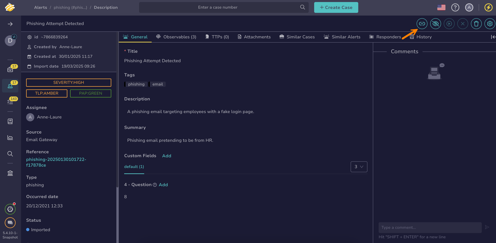

# Unlink an Alert and a Case

This topic provides step-by-step instructions for unlinking an [alert](about-alerts.md) and a [case](../cases/about-cases.md) in TheHive.

An alert is automatically linked to a case when you [create a case from an alert](create-a-case-from-an-alert.md) or [add an alert to an existing case](add-an-alert-to-an-existing-case.md).

!!! note "Status update"
    When you unlink an alert from a case, its [status](../../../administration/status/about-statuses.md) automatically changes to one associated with the *New* stage, regardless of its previous status.

!!! info "Data transfer"
    When unlinking an alert and a case, data from the alert, including observables, TTPs, attachments, comments, and custom fields, remains in the case.

## From a case

1. [Find the case](../cases/search-for-cases/find-a-case.md) where you want to unlink alerts.

2. 

3. Select :fontawesome-solid-ellipsis: next to the alert you want to unlink.

    

4. Select **Unlink**.

5. Select **OK**.

## From an alert



1. [Find the alert](./search-for-alerts/find-an-alert.md) you want to unlink.

2. In the alert, select **Unlink**.

    

3. Select **OK**.

<h2>Next steps</h2>

* [View Alerts Linked to a Case](../cases/view-alerts-linked-to-a-case.md)