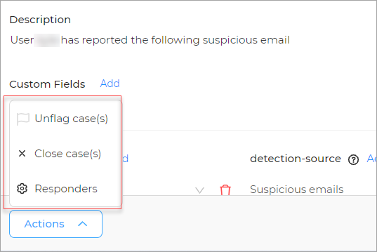
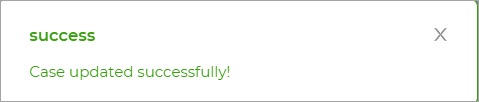
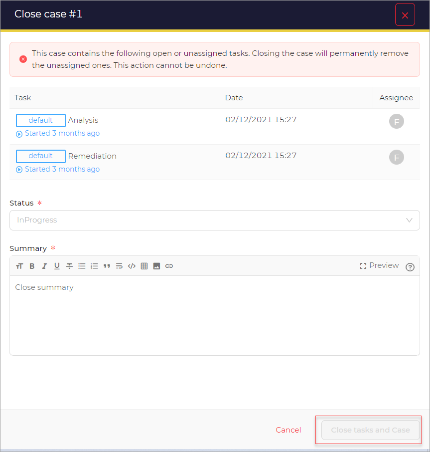

# Actions 

You can make use of any of the available actions.

## Flag/Unflag

1. Click the **Flag/Unflag option** to either flag or unflag a case. 

A pop-up message appears

## Close

1. Click the **Close option** to remove a case

A new window opens.

1. Select **Status** from the list. 
1. Change the **Summary**
1. Click the **Close tasks and case** button.

