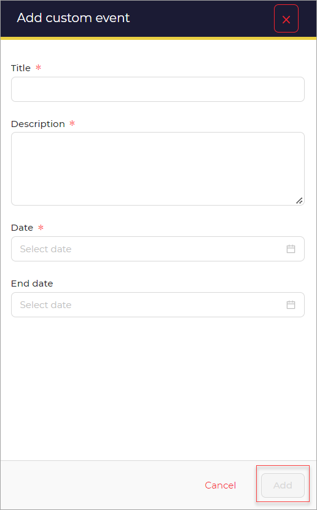

# Add custom event

In this section you can find information about adding cutom events.

To add custom event: 

After clicking the **+** option. 

A new window opens. 

1. Add the **Title**.
1. Enter the **Description**.
1. Select **Date**.
1. Select **End date**.
1. Click the **Add** button.

