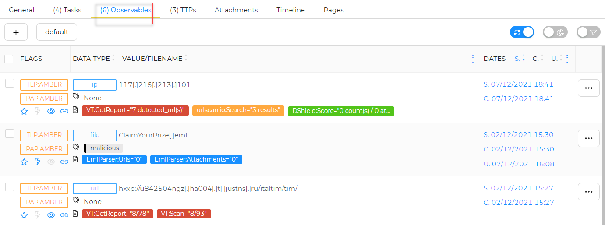
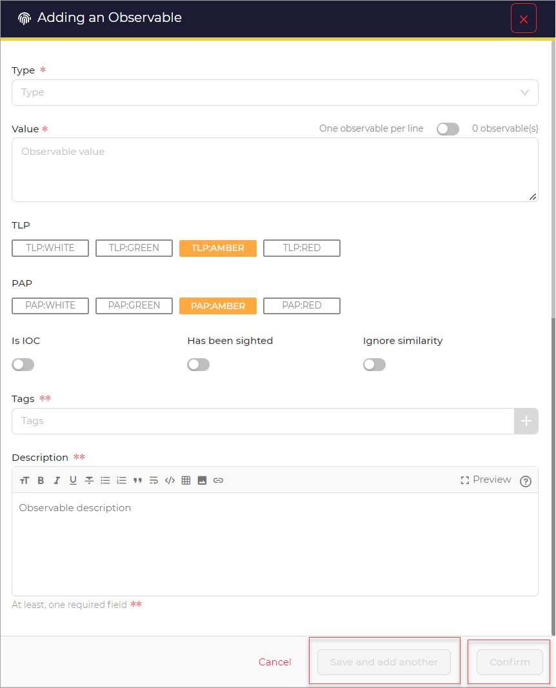
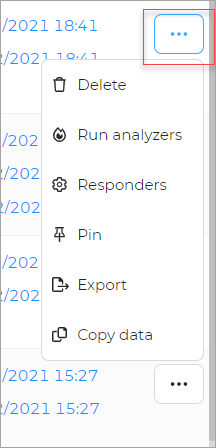
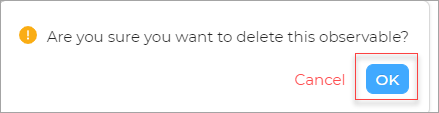
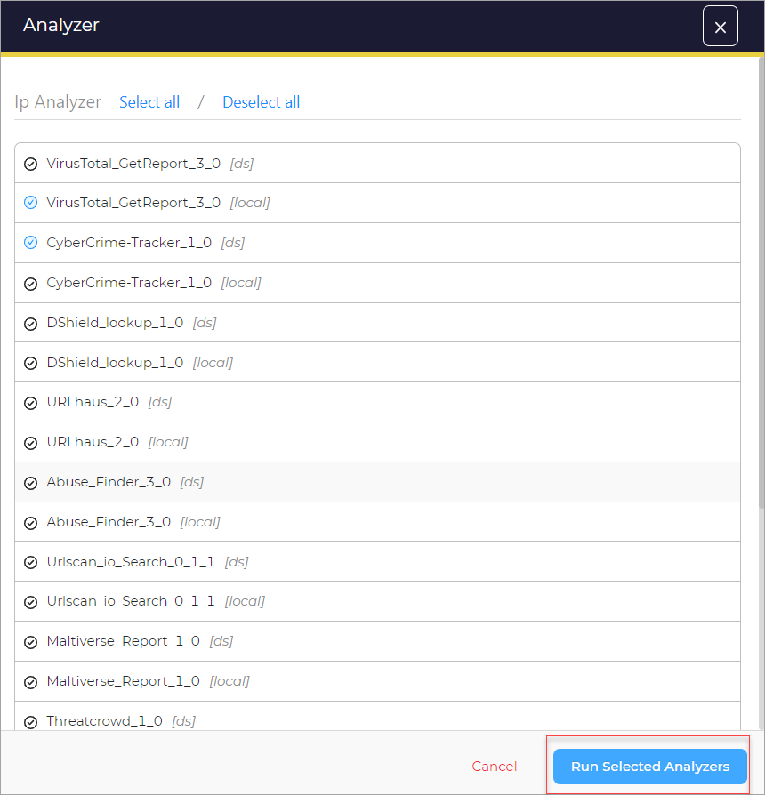
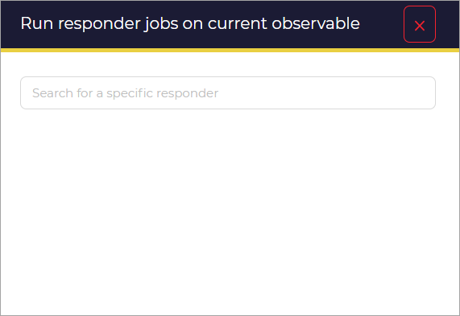
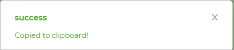

# View observables

In this section you can find information about observables.

Observables represent stateful properties (such as the MD5 hash of a file or the value of a registry key) or measurable events (such as the creation of a registry key or the deletion of a file) that are pertinent to the operation of computers and networks. 

## Add observables

1. Click the **+** to add an observable.
1. Type the **Type**.
1. Type the **Value**.
1. Select **TLP**, (White/Green/Amber/Red) from the options.
1. Select **PAP**, (White/Green/Amber/Red) from the options.
1. Switch the on button for **Is IOC**. (IoC repository contains objects, and each of the objects contain a specific piece of information.)
1. Switch on the button for **Has Been Sighted**. 
1. Switch on the button for **Ignore Similarity**. 
1. Add Tags. (Refer to [`Add tags`](../cases/adding_to_a_case.md#add-tags)).
1. Type the **Description**. 
1. Click the **Save and add another** button. 
1. Click the **Confirm** button. 

## Observables Actions 

You can make use of any of the available actions.

### Delete

1. Click the **Delete option** to remove an observable.

A message pops-up

1. Click the **OK** button. 

### Run Analyzers

1. Click the **Run Analyzers** option.

A new window opens.

1. Select one or more **Analyzers** from the list.
1. Click the **Run Analyzers** button.  

### Responders

1. Click the **Responders** option.

### Pin/Unpin

1. Click the **Pin/Unpin option** to pin or unpin observables.

### Export 

To Export an observable details file: 

1. Click the **Export** option.
1. A file is downloaded, that can be exported/sent.

### Copy Data

1. Click the **Copy data option**.

