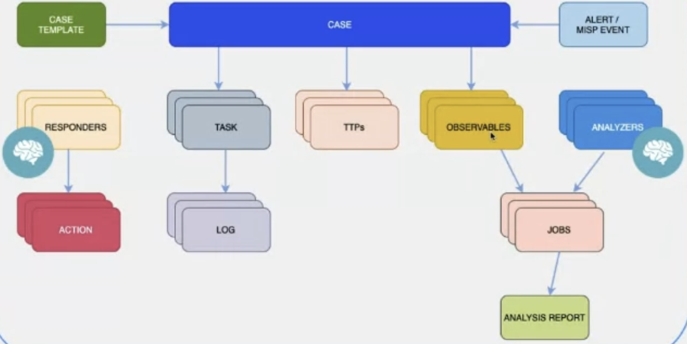

# About Cases

This topic explains cases, their components, and how to create them in TheHive.

## Overview

## Definition

A case is a structured entity used to track, investigate, and respond to security incidents, threats, or suspicious activities. It serves as a central repository where security teams organize information, collaborate on investigations, and document their findings.

## Key components

In TheHive, a case consists of the following elements:

* [Observables](../cases/cases-description/observables.md): Data points such as IP addresses, file hashes, domains, and email addresses that are relevant to an investigation.

* [Tasks](../tasks/about-tasks.md): Actions assigned to analysts to analyze, assess, and mitigate threats.

* [TTPs (Tactics, techniques, and procedures)](../cases/cases-description/ttps.md): The methods and strategies used by attackers.

## Sources

In TheHive, you can create a case from the following sources:

* [Manual entry](../cases/create-empty-case.md): Create a case manually by entering details.

* [Case templates](../cases/create-case-from-template.md): Use predefined templates to standardize case creation.

* [Archived cases](../cases/create-case-from-archive.md): Restore cases from previous investigations stored in TheHive.

* [Alerts](../alerts/alerts-description/new-case-from-selection.md): Convert security alerts generated by detection tools (SIEM - Security information and event management, EDR - Endpoint detection and response, IDS - Intrusion detection system, etc.) into cases for further investigation.

* [MISP event files](../cases/create-case-from-misp.md): Import alerts from MISP (Malware information sharing platform) event data and convert them into cases for further investigation.

## Next steps

* [Find a Case](../cases/search-for-cases/find-a-case.md)
* [Create an Empty Case](../cases/create-empty-case.md)
* [Create a Case from Templates](../cases/create-case-from-template.md)
* [Create a Case from Archive](../cases/create-case-from-archive.md)
* [Create a Case from an Alert](../alerts/alerts-description/new-case-from-selection.md)
* [Create a Case from MISP](../cases/create-case-from-misp.md)