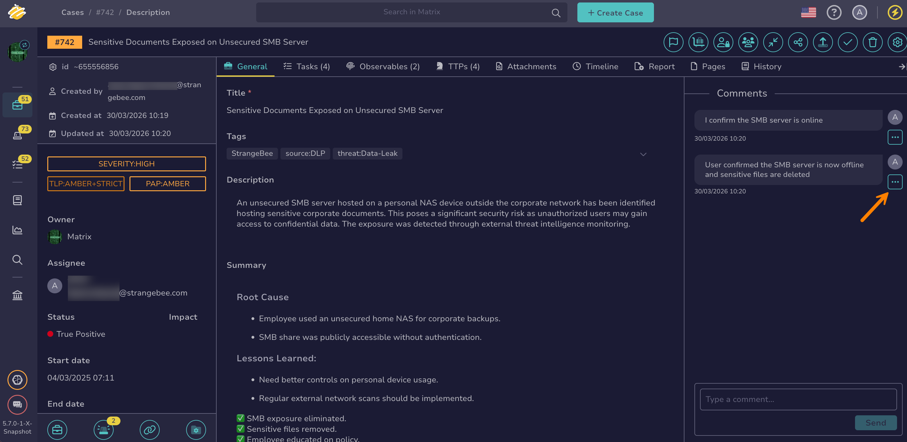

# Share a Comment

<!-- md:version 5.7 --> <!-- md:permission `manageComment` -->

Share a comment on a case or alert with your teammates through a messaging tool or email.

<h2>Procedure</h2>

1. [Find the case](../search-for-cases/find-a-case.md) or [the alert](../../alerts/search-for-alerts/find-an-alert.md) where the comment you want to share is located.

2. In the right pane, select :fontawesome-solid-ellipsis: next to the comment you want to share.

    

3. Select **Copy link**.

The comment link is copied to the clipboard and is ready to share.

<h2>Next steps</h2>

* [Comment on a Case](comment-on-case.md)