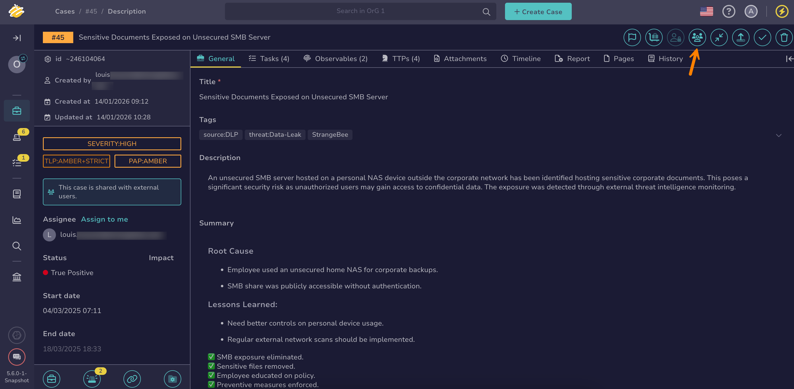

# Share a Case with External Users

<!-- md:version 5.6 --> <!-- md:permission `manageCaseAccess/external` --> <!-- md:license Platinum -->

Share cases with external users to enable controlled collaboration with stakeholders outside the Security Operations Center (SOC) team. Through [TheHive Portal](../../../../administration/thehive-portal/about-thehive-portal.md), external users can view case information and contribute based on their profile permissions—creating cases, adding comments, uploading attachments, and submitting observables.

!!! info "Limitation"
    [Cases with restricted visibility](../about-cases.md#case-visibility-restriction) can't be shared with external users.

!!! note "Information sharing control"
    When cases are shared with external users, SOC teams control exactly what information becomes visible through the portal:

    * Comments: Comments aren't automatically shared when a case is shared. Each comment requires [explicit marking as external](control-case-comment-access-thehive-portal.md) to be visible in the portal.
    * Attachments: Like comments, attachments must be individually [marked as external](../attachments/share-an-attachment-case-alert.md#share-an-attachment-with-external-users) for portal visibility.
    * Observables: Observables created by analysts remain private and can't be shared with external users. Only observables created by external users themselves are visible in the portal.

!!! tip "Sharing with internal organizations"
    To share cases with users from other internal organizations within TheHive, configure [sharing rules between organizations](../../../../administration/organizations/about-organizations-sharing-rules.md).

<h2>Procedure</h2>

!!! warning "Prerequisite"
    External users must already exist in TheHive with the External account type. [Create External user accounts](../../../../administration/thehive-portal/set-up-thehive-portal-access.md#step-2-create-external-user-accounts) before sharing cases with them.

!!! tip "Bulk sharing"
    To share multiple cases in bulk with external users, go to the **Cases** view and select :fontawesome-regular-square: next to each case you want to share. Then select **Manage external access** above the list.

1. [Locate the case you want to share](../search-for-cases/find-a-case.md).

2. Select the **Manage external access** button.

    

3. In the **External access management** drawer, select **All external users** or **Selected external users**.

    !!! danger "Future external users"
        Authorizing all external users grants access to both current and future external users.

4. Optional: If you selected **Selected external users**, select the authorized users.

5. Select **Confirm**.

<h2>Next steps</h2>

* [Revoke Case Access for External Users](revoke-case-access-external-users.md)