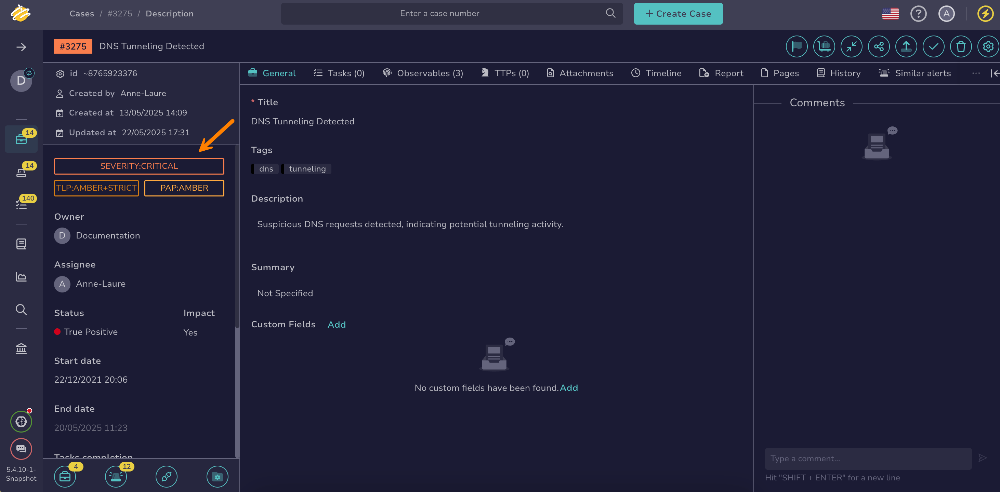

# How to Change Case or Alert Classification Settings

This topic provides step-by-step instructions for changing the classification settings of a [case](about-cases.md) or [alert](../alerts/about-alerts.md) in TheHive, including severity, Traffic Light Protocol (TLP), and Permissible Actions Protocol (PAP).

{!includes/access-change-case-alert-classification-settings.md!}

<h2>Procedure</h2>

1. Find the [case](../cases/search-for-cases/find-a-case.md) or the [alert](../alerts/search-for-alerts/find-an-alert.md) you want to update.

2. In the case or alert, move through the left pane.

    

3. Select the severity button to update its value. It indicates the severity level of the case or alert.

4. Select the TLP button to update its value. It indicates how you can share information about the case or alert with others. Refer to the [MISP taxonomy](https://www.misp-project.org/taxonomies.html#_tlp) for detailed definitions of TLP values.

5. Select the PAP button to update its value. It specifies which actions you can take with the data of the case or alert. Refer to the [MISP taxonomy](https://www.misp-project.org/taxonomies.html#_pap) for detailed definitions of PAP values.

<h2>Next steps</h2>

* [Change a Case Status](change-status-case.md)
* [Add a Link to a Case](./case-links/add-a-link-to-a-case.md)
* [Apply a Case Template](apply-a-case-template.md)
* [Share a Case](share-a-case.md)
* [Change an Alert Status](../alerts/change-status-alert.md)
* [Enrich Alert Details](../alerts/enrich-alert-details.md)