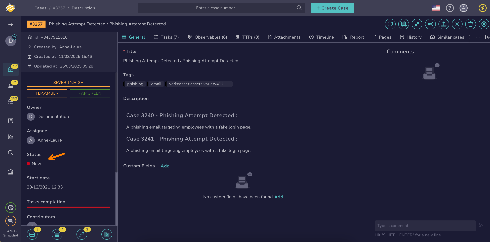

# Change a Case Status

This topic provides step-by-step instructions for changing the [status](../../../administration/status/about-statuses.md) of a [case](about-cases.md) in TheHive.

{!includes/access-change-status-case.md!}

<h2>Procedure</h2>

1. Find [the case](../cases/search-for-cases/find-a-case.md) you want to update.

2. In the case, move through the **Status** section in the left pane.

    

3. Select the new status from the dropdown list.

    !!! tip "Can't find a status?"
        If you can't find the status you need, it may be due to one of the following reasons:

        * The status isn't available from the case description page. Statuses linked to the *Closed* stage are available only when [closing a case](../cases/close-a-case.md).
        * The status doesn't exist yet, or someone may have deleted or hidden it. Contact someone with admin-level permissions to [create it](../../../administration/status/create-a-status.md) or [restore it](../../../administration/status/change-visibility-of-a-status.md).

4. Select **Save**.

<h2>Next steps</h2>

* [Change Case or Alert Classification Settings](change-case-alert-classification-settings.md)
* [Add a Link to a Case](./case-links/add-a-link-to-a-case.md)
* [Apply a Case Template](apply-a-case-template.md)
* [Share a Case](share-a-case.md)