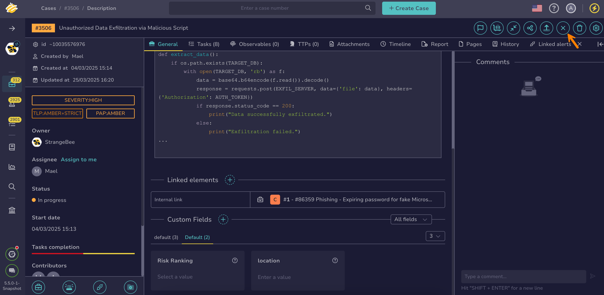

# How to Close a Case

This topic provides step-by-step instructions for closing a [case](about-cases.md) in TheHive.

!!! info "Pending tasks"
    Closing a case also permanently closes all pending tasks. This action can't be undone.

{!includes/access-close-cases.md!}

<h2>Procedure</h2>

1. [Find the case](../cases/search-for-cases/find-a-case.md) you want to close.

2. In the case description, select :fontawesome-solid-xmark:.

    

3. In the **Close case** drawer, select the status that reflects the outcome of the investigation.

4. Enter a summary describing the outcome of the investigation.

5. Add or remove values in [custom fields](../../../administration/custom-fields/about-custom-fields.md) as needed. 

    !!! info "Custom fields completion"
        You can't close a case unless all mandatory custom fields are completed.

6. Select **Close tasks and case**.

<h2>Next steps</h2>

* [Export a Case to MISP](export-a-case-to-misp.md)
* [Export an Archived Case](export-an-archived-case.md)