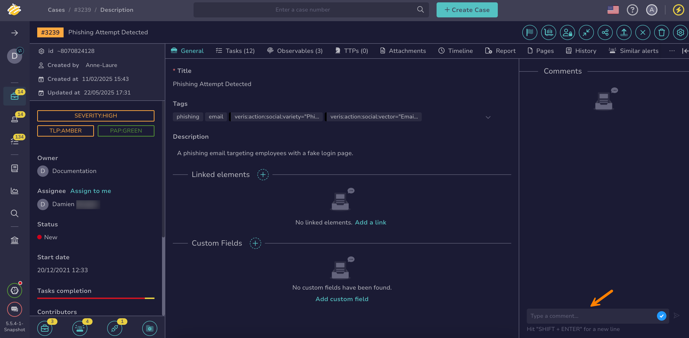

# Comment on a Case or Alert

This topic provides step-by-step instructions for adding comments to a [case](about-cases.md) or an [alert](../alerts/about-alerts.md) in TheHive.

Comments are visible to all organizations that share the case or alert.

Use this procedure to provide feedback or leave notes for your team.



<h2>Procedure</h2>

1. [Find the case](./search-for-cases/find-a-case.md) or [alert](../alerts/search-for-alerts/find-an-alert.md) where you want to add a comment.

2. In the right pane of the screen, enter a comment.

    

3. Select :fontawesome-solid-paper-plane:.

<h2>Next steps</h2>

* [Add Tasks to a Case](add-tasks-to-a-case.md)
* [Add a Link to a Case](./case-links/add-a-link-to-a-case.md)
* [Enter Values in Custom Fields](./custom-fields/enter-values-in-custom-fields.md)
* [Add an Observable](./observables/add-an-observable.md)
* [Add or Remove Tags](./tags/add-remove-tags.md)
* [Add Tactics, Techniques and Procedures](./ttps/add-ttps.md)
* [Change Case or Alert Classification Settings](change-case-alert-classification-settings.md)
* [Change a Case Status](change-status-case.md)
* [Flag a Case](flag-a-case.md)
* [Assign an Alert](../alerts/assign-an-alert.md)
* [Change an Alert Status](../alerts/change-status-alert.md)
* [Enrich Alert Details](../alerts/enrich-alert-details.md)
