# From template
Create a new case from templates

## 1. Create a new case from EDR template.

1. Enter the case title in the **Title**.
1. Select the date from the **Date**. 
1. Select **Severity**, (Low/Medium/High/Critical).
1. Select **TLP**, (White/Green/Amber/Red).
1. Select **PAP**, (White/Green/Amber/Red).
1. Click **+** to add **Tags**. (Refer to [`Add tags`](#add-tags).)
1. Enter the case description in the **Description**. 
1. Choose a **Task rule** from the list, (manual/existingOnly/upcommingOnly/all).
1. Choose an **Observable rule** from the list, (manual/existingOnly/upcommingOnly/all).
1. Add Tasks. (Refer to [`Add tasks`](#add-tasks). / [`Edit tasks`](#edit-tasks). /[`Delete tasks`](#delete-tasks).) 
1. Add Custom Fields. (Refer to [`Add custom field values`](#add-custom-field-values). /[`Edit custom field values`](#edit-custom-field-values). /[`Delete custom field values`](#delete-custom-field-values).)
1. Add Pages. (Refer to [`Add pages`](#add-pages). /[`Delete pages`](#delete-pages).)
1. Sharing (Refer to [`Sharing`](#Sharing).)
1. Click the **Confirm case creation** button. 

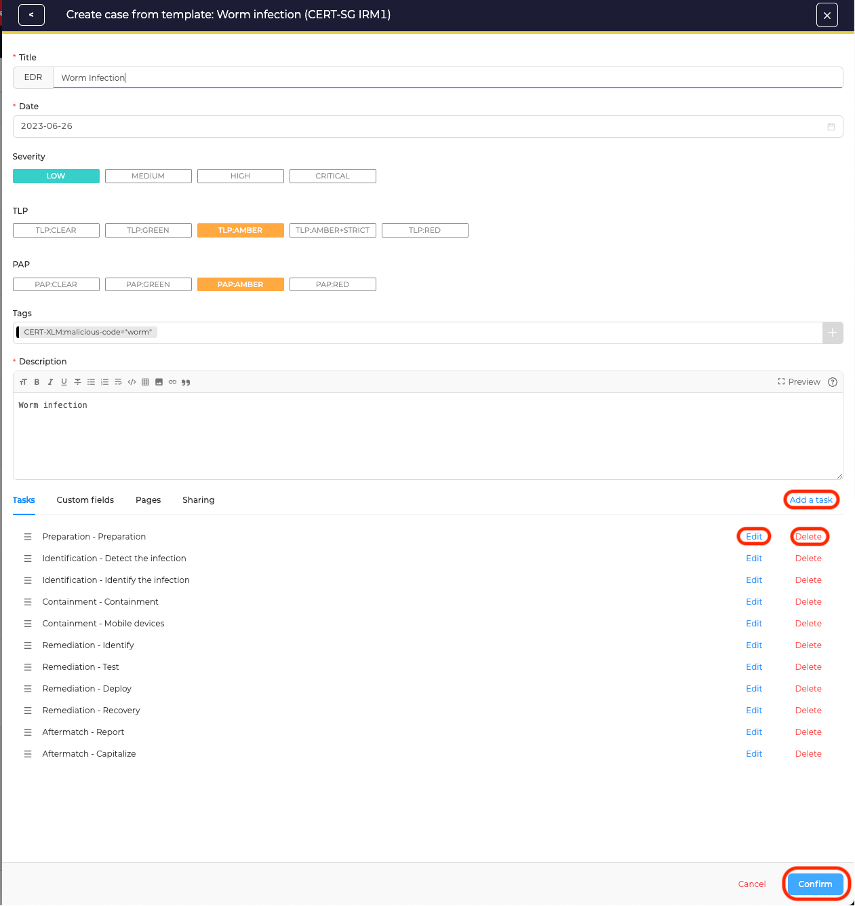

## 2. Create a new case from Phishing template.

1. Enter the case title in the **Title**.
1. Select the date from the **Date**. 
1. Select **Severity**, (Low/Medium/High/Critical).
1. Select **TLP**, (White/Green/Amber/Red).
1. Select **PAP**, (White/Green/Amber/Red).
1. Click **+** to add **Tags**. (Refer to [`Add tags`](#add-tags).)
1. Enter the case description in the **Description**. 
1. Choose a **Task rule** from the list, (manual/existingOnly/upcommingOnly/all).
1. Choose an **Observable rule** from the list, (manual/existingOnly/upcommingOnly/all).
1. Add Tasks. (Refer to [`Add tasks`](#add-tasks). /[`Edit tasks`](#edit-tasks). /[`Delete tasks`](#delete-tasks).) 
1. Add Custom Fields. (Refer to [`Add custom field values`](#add-custom-field-values). /[`Edit custom field values`](#edit-custom-field-values). /[`Delete custom field values`](#delete-custom-field-values).)
1. Add Pages. (Refer to [`Add pages`](#add-pages). /[`Edit pages`](#edit-pages). /[`Delete pages`](#delete-pages).)
1. Sharing (Refer to [`Sharing`](#Sharing).) 
1. Click the **Confirm case creation** button. 

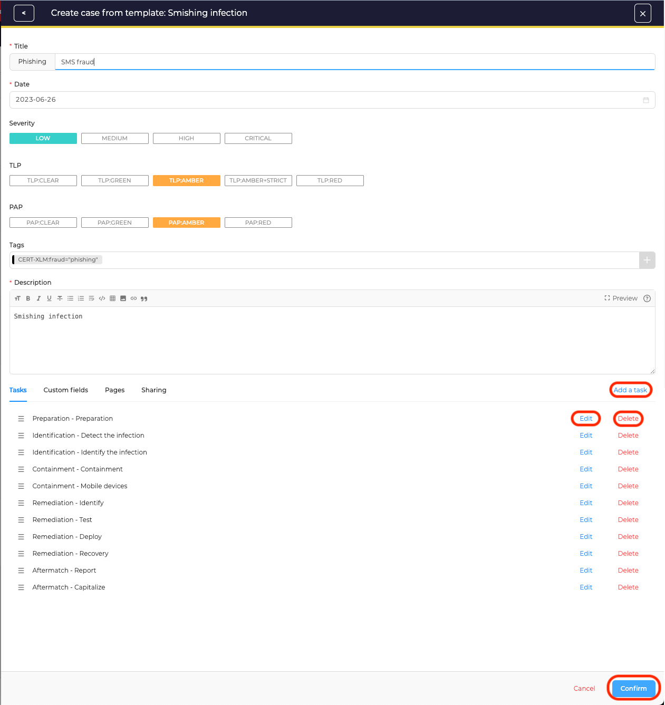

## Add tags 
1. Choose tags from the Taxonomy.
The selected tag will appear in the **Selected Tags** box
1. Click the **Add selected tags** button.

## Add tasks 
The task **Group** is default. 

1. Enter the task **Title**.
1. Enter the task description in the **Description**. 
1. Select the **Due date**. 
1. Click **Confirm**.
1. Click **Save and add another**, to add another task. 

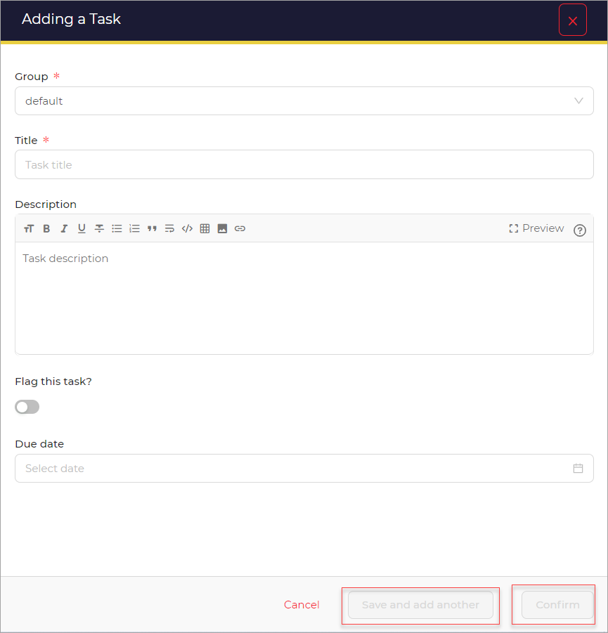

## Add custom field values 
1. Select custom field value from the given list. (location/business-unit/detection-source/test).
1. Click **Confirm custom field value creation**.

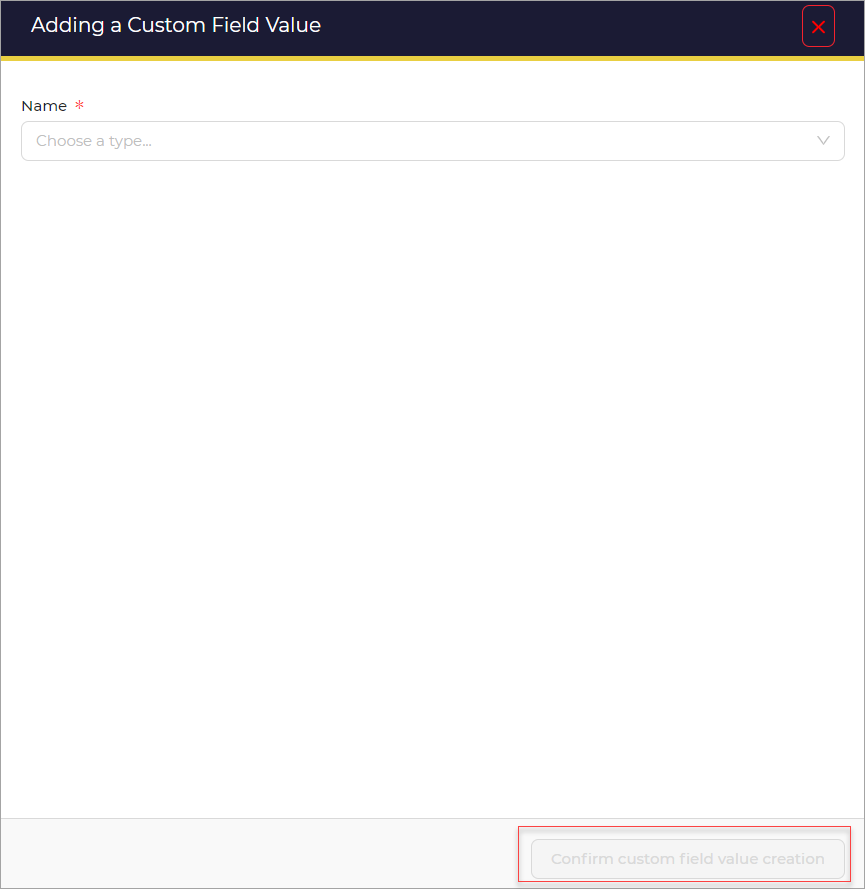

## Add pages
By selecting **Create new page**

1. Enter the page **Title**.
1. Enter or select the **Category**. 
1. Enter the page content in the **content**. 
1. Click **Confirm**.
1. Click **Save and add another**, to add another task. 

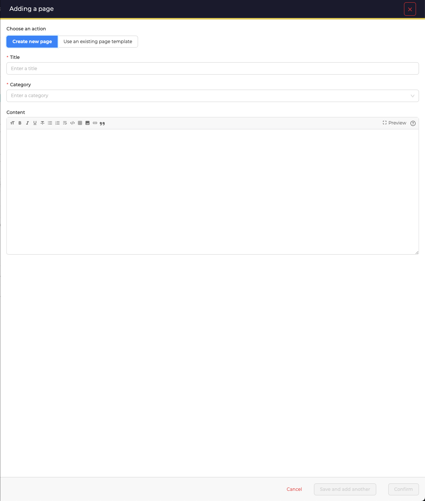

By selecting **Use an existing page template**

1. Choose template(s) from those available in the list of existing templates
1. Click **Confirm**.
1. Click **Save and add another**, to add another task. 

## Edit tasks 
1. Click the edit link.

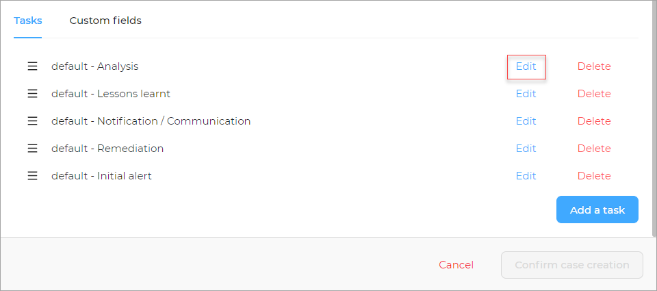

A new window opens. 

1. Edit the required values 
1. Click the **Confirm edition** button.

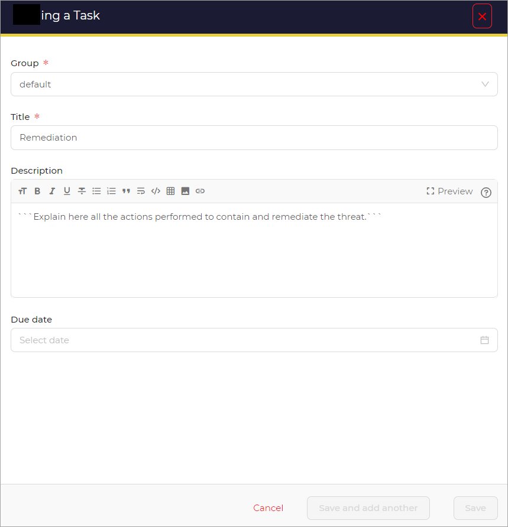

## Edit custom field values 
1. Click the edit link.

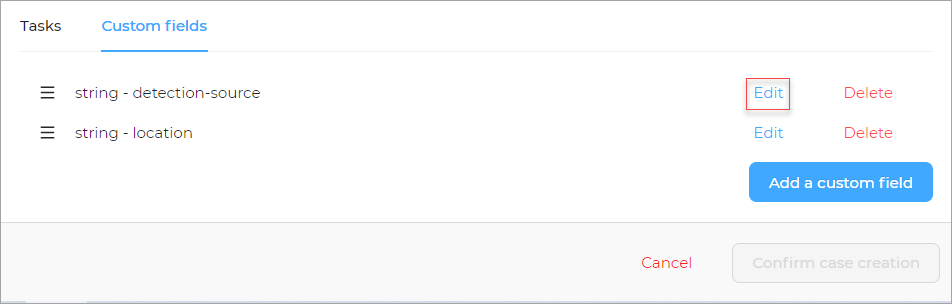

A new window opens.

1. Edit the required custom field values 
1. Click the **Confirm custom field value edition** button.

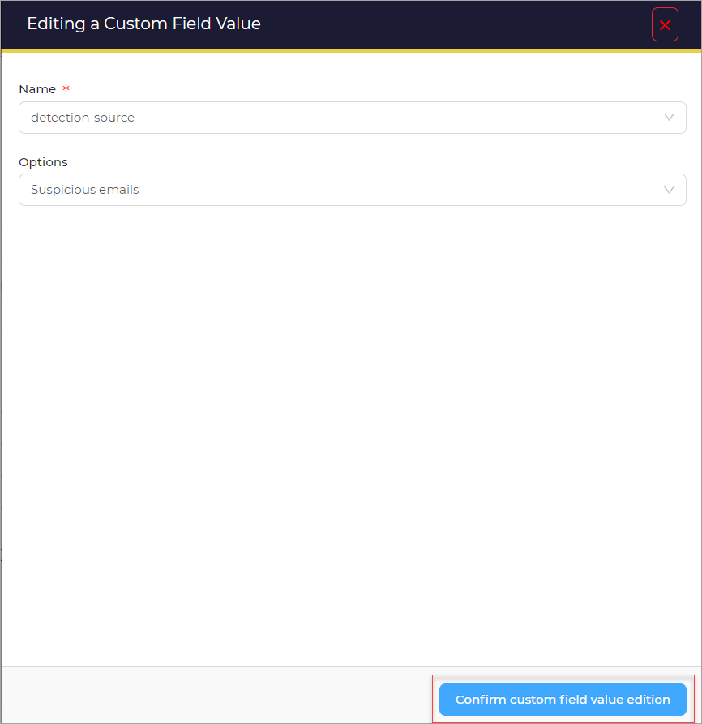

## Delete tasks
1. Click the delete link beside the value that has to be deleted. 

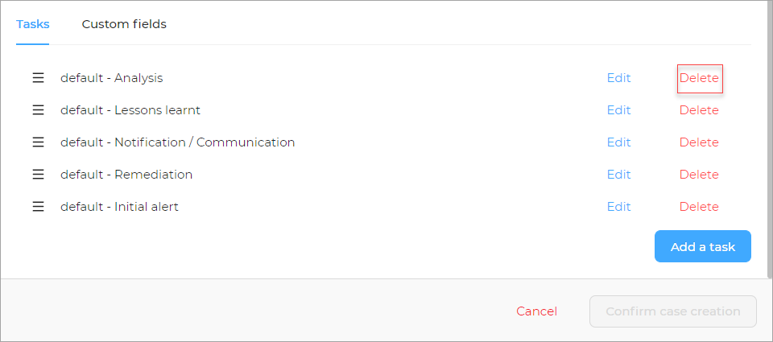

## Delete custom field values
1. Click the delete link beside the custom field value that has to be deleted. 

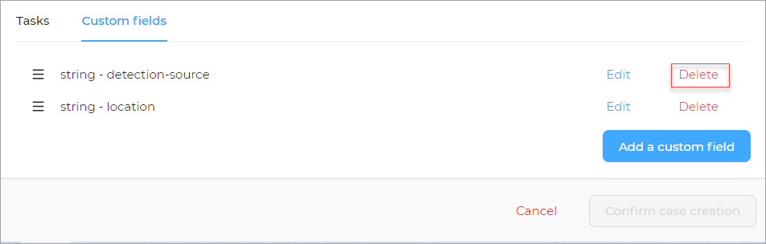

## Delete pages
1. Click the delete link beside the value that has to be deleted. 

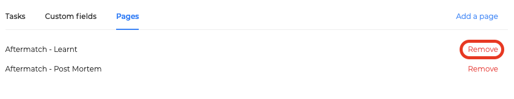