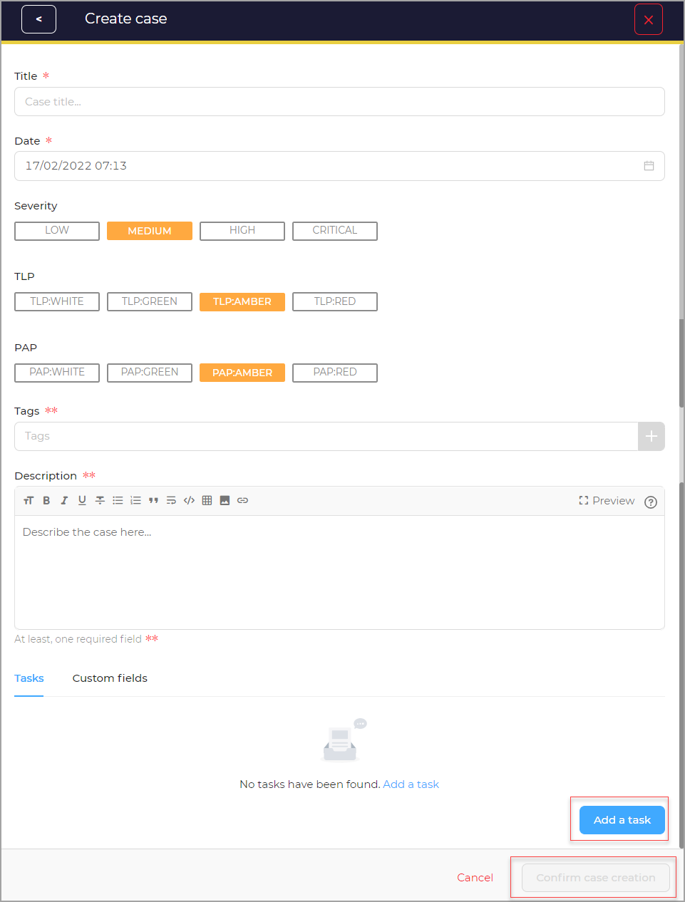

# From an empty case

Create a new case from an empty case. 

1. Enter the case title in the **Title**.
1. Select the date from the **Date**. 
1. Select **Severity**, (Low/Medium/High/Critical).
1. Select **TLP**, (White/Green/Amber/Red).
1. Select **PAP**, (White/Green/Amber/Red).
1. Click **+** to add **Tags**. (Refer to [`Add tags`](../cases/adding_to_a_case.md#add-tags)).
1. Enter the case description in the **Description**. 
1. Choose a **Task rule** from the list, (manual/existingOnly/upcommingOnly/all).
1. Choose an **Observable rule** from the list, (manual/existingOnly/upcommingOnly/all).
1. Add Tasks. (Refer to [`Add tasks`](../cases/adding_to_a_case.md#add-tasks)).
1. Add Custom Fields. (Refer to [`Add custom field values`](../cases/adding_to_a_case.md#add-custom-field-values)).
1. Click the **Confirm case creation** button. 

