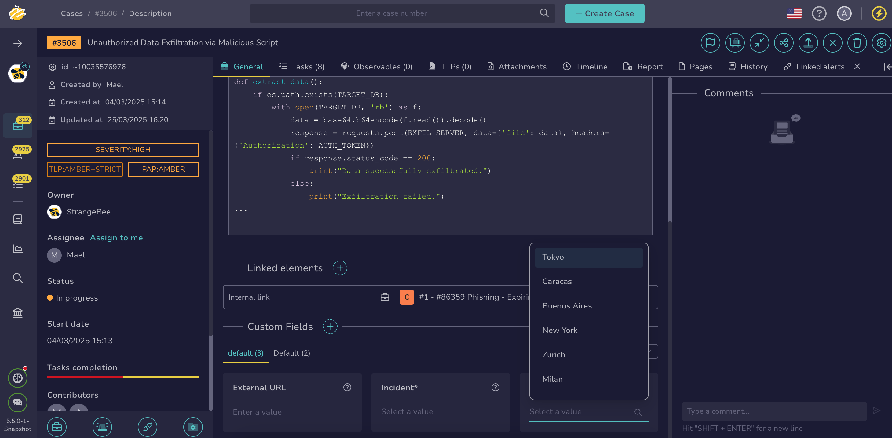
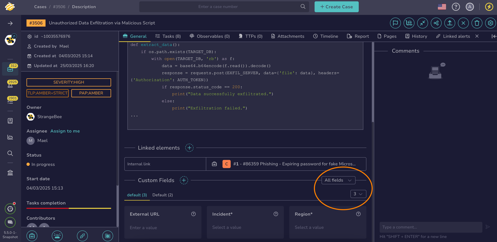

# Enter Values in Custom Fields

<!-- md:permission `manageCase/update` --> <!-- md:permission `manageAlert/update` -->

Enter values in [custom fields](../../../../administration/custom-fields/about-custom-fields.md) in a [case](../about-cases.md) or an [alert](../../alerts/about-alerts.md) in TheHive to record company-specific information.

!!! tip "Can't enter a value in a custom field?"
    If you can't enter the value you need in a custom field, the field may not be configured correctly. Contact someone with admin-level permissions to [update the configuration](../../../../administration/custom-fields/manage-a-custom-field.md).

<h2>Procedure</h2>

1. Find the [case](../../cases/search-for-cases/find-a-case.md) or the [alert](../../alerts/search-for-alerts/find-an-alert.md) where you want to enter values in custom fields.

2. 

3. Enter a value under the custom field name. Depending on the configuration, the field will either accept free text or provide a dropdown list of options.

    

    !!! tip "<!-- md:version 5.5 --> Custom field view"
        You can filter mandatory custom fields and choose how many custom fields to display per line.

        

4. Optional: Select **Add** to enter another value, if available.

5. Optional: Use the :fontawesome-solid-trash: symbol to delete an entire entry in a multi-line custom field. Use the :fontawesome-solid-circle-xmark: symbol to remove a value from the field.

6. Select **Confirm**.

<h2>Next steps</h2>

* [Add Custom Fields](add-custom-fields.md)
* [Remove Custom Fields](remove-custom-fields.md)