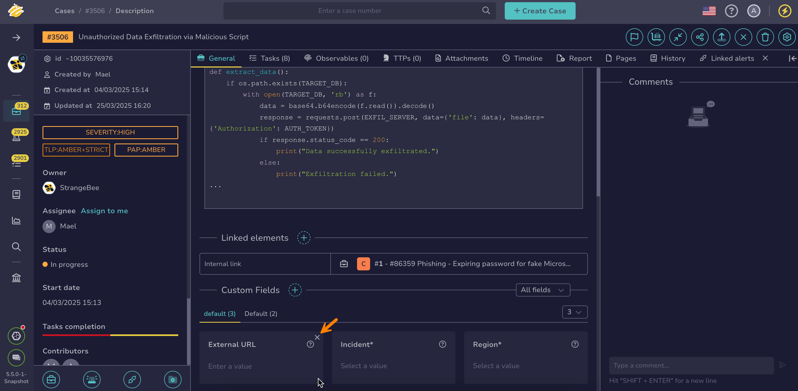

# Remove Custom Fields

This topic provides step-by-step instructions for removing [custom fields](../../../../administration/custom-fields/about-custom-fields.md) from a [case](../about-cases.md) or an [alert](../../alerts/about-alerts.md) in TheHive.

{!includes/access-manage-custom-fields.md!}

<h2>Procedure</h2>

1. Find the [case](../../cases/search-for-cases/find-a-case.md) or the [alert](../../alerts/search-for-alerts/find-an-alert.md) where you want to remove custom fields.

2. {!includes/custom-fields-section-go-to.md!}

3. Select :fontawesome-solid-xmark: in the top-right corner of the custom field you want to remove.

    

4. Select **OK**.

<h2>Next steps</h2>

* [Add Custom Fields](add-custom-fields.md)
* [Enter Values in Custom Fields](enter-values-in-custom-fields.md)