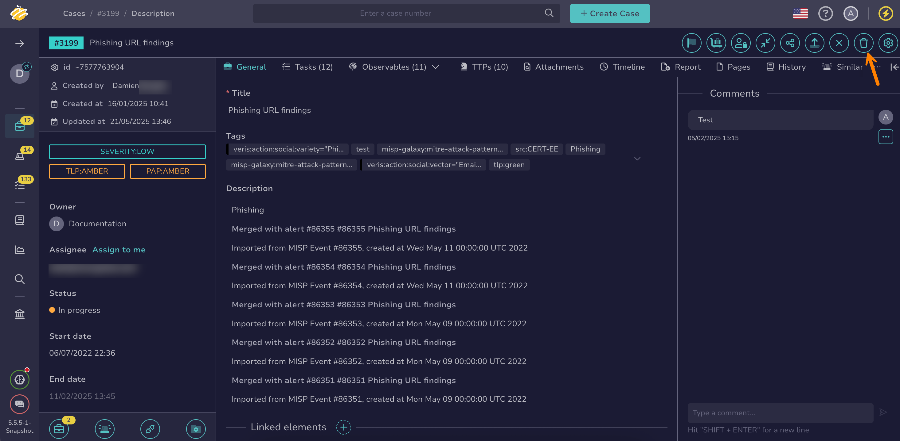

# Delete a Case

<!-- md:permission `manageCase/delete` -->

This topic provides step-by-step instructions for deleting a [case](about-cases.md) in TheHive.

Use this procedure to permanently delete a case. To close a case because it's a false positive or duplicate, use [Close a Case](close-a-case.md) instead.

!!! danger "Permanent action"
    Deleting a case is an irreversible action. Once deleted, no one—not even the StrangeBee Support team—can recover the case.

<h2>Procedure</h2>

1. [Find the case](../cases/search-for-cases/find-a-case.md) you want to delete.

2. In the case, select :fontawesome-solid-trash:.

    

3. Select **Confirm**.

<h2>Next steps</h2>

* [Create a Case](create-a-new-case.md)