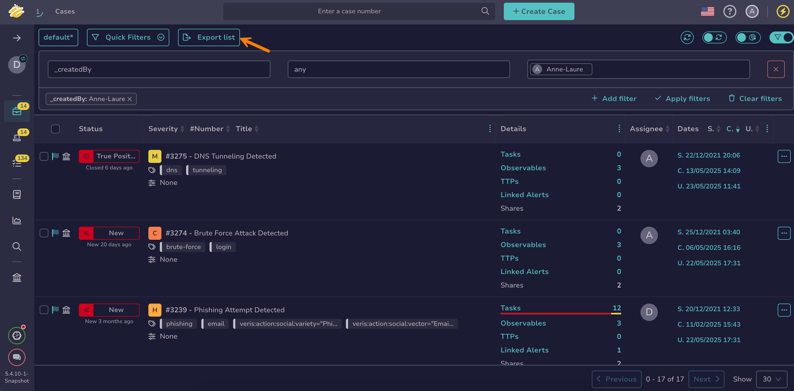

# Export a List of Cases

Export a list of [cases](about-cases.md) in TheHive to share information, create reports, or analyze data outside the platform.

<h2>Procedure</h2>

1. 

2. Select **Export list** to export all displayed cases, reflecting the applied [filters and sorting](../about-filtering-and-sorting.md). To export a specific selection of cases, select :fontawesome-regular-square: next to the cases you want to export, then select **Export selection**.

    

3. In the **Export cases to file** drawer, select your preferred formatting options.

4. Select **Export to file**.

<h2>Next steps</h2>

* [Add Tasks to a Case](add-tasks-to-a-case.md)
* [Apply a Case Template](apply-a-case-template.md)
* [Change a Case Status](change-status-case.md)
* [View Alerts Linked to a Case](view-alerts-linked-to-a-case.md)
* [Close a Case](close-a-case.md)
* [Merge Cases](merge-cases.md)