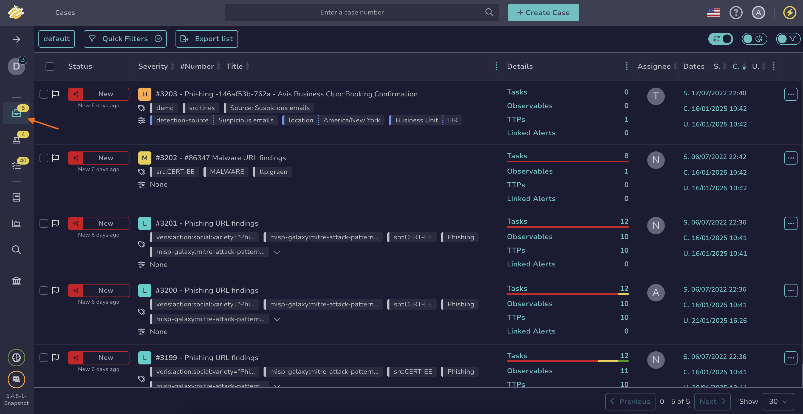

# Methods for searching a case

This topic provides an overview of the various search methods available in TheHive for finding cases, along with use cases for when to apply each method.

* [Option 1: Enter a case number search box](#option-1-enter-a-case-number-search-box)  
If you already know the case number you're looking for.

* [Option 2: Similar cases](#option-2-similar-cases)  
If you want to find one or more cases similar to a known case without needing to perform actions on them simultaneously.

* [Option 3: Filters in the cases view](#option-3-filters-in-the-case-view)  
If you don't know the case number you're looking for or need to search for multiple cases to perform actions on them simultaneously.

* [Option 4: Global Search feature](#option-4-global-search-feature)  
If you don't know the case number you're looking for or need to conduct complex searches for multiple cases without requiring simultaneous actions.

---

## Option 1: Enter a case number search box

### When to use it

If you already know the case number you're looking for.

### How to access

Simply enter the case number in the search box located at the top of the page, visible across all views.

### Results

The case description is displayed.

---

## Option 2: Similar cases

### When to use it

If you want to find one or more cases similar to a known case without needing to perform actions on them simultaneously.

### How to access

In a case description, go to the **Similar cases** tab.

Select **Quick Filters** to access predefined filters.

### Results

Based on your inputs, a list of results will appear in the **Similar cases** tab. A maximum of 300 results can be shown per page, and you can navigate through the results using **Previous** and **Next**.

---

## Option 3: Filters in the cases view

### When to use it

If you don't know the case number you're looking for or need to search for multiple cases to perform actions on them simultaneously.

### How to access

Filter cases in the cases view, accessible directly from the sidebar menu.

You have three available approaches, which can be used together for more refined results:

* Select **Quick Filters** to access predefined filters.

* Turn on the **Filters** toggle to apply one or more filters of your choice.

* Select a value from a case field to use it as a filter criterion.

### Results

Based on your inputs, the cases view will display a list of results. A maximum of 300 results can be shown per page, and you can navigate through the results using **Previous** and **Next**.

---

## Option 4: Global Search feature

### When to use it

If you don't know the case number you're looking for or need to conduct complex searches for multiple cases without requiring simultaneous actions.

### How to access

You can access the Search feature directly through the sidebar menu.

Select the **Cases** item on the Search Scope pane.

!!! tip
    Select the **All elements** item for a comprehensive tool-wide overview that encompasses all entity types (cases, alerts, observables, jobs, tasks, and task logs), to analyze cross-linked information, or to conduct a detailed investigation.

#### Search box

A search box is displayed by default, allowing you to enter the keywords you want to search for.

!!! warning
    Wildcard search has been available since version 5.4.7. Other advanced search options, such as Boolean and phrase searches, are not supported.

You can use the wildcard character *\** to broaden your searches and capture multiple variations.

Examples of use cases:

* **Email domains**: Entering *\*@gmail.com* will return entities containing the gmail.com domain.
* **IP subnets**: Entering *192.168.\*.\** will return entities with IP addresses in the 192.168.x.x subnet.
* **URLs**: Entering *https://malwaredomain.com/\** will return entities hosted under the malwaredomain.com directory.

!!! info
    If you can't find what you're looking for using the Search feature and want to learn more about how fields are indexed for search, refer to the [Search indexation modes](thehive/user-guides/analyst-corner/search-methods/search-indexation-modes.md) topic.

#### Filters

In addition to the search box, you can apply one or more filters by selecting **Add New Filter**. These filters refine your search results and act as an equivalent to the AND operator in Boolean search.

Filters are mandatory in the following cases:

* **Fields with specific date formats**: Ensures accurate data handling.
* **[Custom fields](../../../administration/custom-fields.md)**: Ensures the search engine interprets values correctly.

### Results

Based on your inputs, the Search Results pane will display a list of results. A maximum of 300 results can be shown per page, and you can navigate through the results using **Previous** and **Next**.

## What's next?

* [Actions on cases](../cases-list/actions.md)
* [View a case](../cases-list/general.md)
* [Adding to a case (tags/tasks/custom field values)](../cases/adding_to_a_case.md)
* [View tasks](../cases-list/tasks.md)
* [View observables](../cases-list/observables.md)
* [View TTPs](../cases-list/ttps.md)
* [View attachments](../cases-list/attachments.md)
* [View timeline](../cases-list/timeline.md)
* [View pages](../cases-list/pages.md)
* [Run responders on case](../cases-list/run-responders.md)
* [Run analyzers on case](../cases-list/run-analyzer.md)
