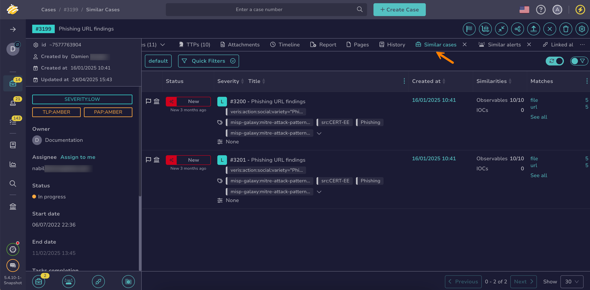

# Find Similar Alerts or Cases

Find similar [alerts](../alerts/about-alerts.md) and [cases](about-cases.md) in TheHive to identify related incidents and correlate information across your investigations. Similarity checks between cases and alerts are based on [observables](../cases/observables/about-observables.md#similar-alerts-and-cases).



## Find similar alerts

1. [Find the alert](../alerts/search-for-alerts/find-an-alert.md) or [case](../cases/search-for-cases/find-a-case.md) you want to compare for similarity.

2. Select the **Similar alerts** tab.

    

    

3. Select **See all** in the **Matches** column to view the list of common observables.

    

## Find similar cases

1. [Find the alert](../alerts/search-for-alerts/find-an-alert.md) or [case](../cases/search-for-cases/find-a-case.md) you want to compare for similarity.

2. Select the **Similar cases** tab.

    

    

3. Select **See all** in the **Matches** column to view the list of common observables.

    

<h2>Next steps</h2>

* [Merge Cases](merge-cases.md)
* [Create a Case from an Alert](../alerts/create-a-case-from-an-alert.md)
* [Add an Alert to an Existing Case](../alerts/add-an-alert-to-an-existing-case.md)