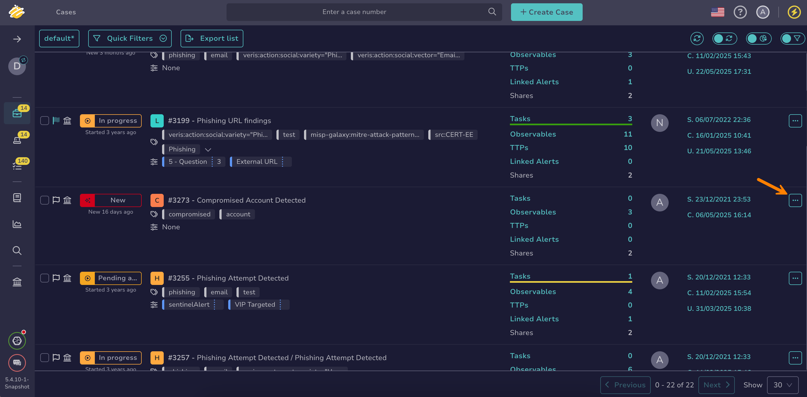

# Flag a Case

This topic provides step-by-step instructions for flagging a [case](about-cases.md) in TheHive.

Use this procedure to highlight a case for all users in your organization. Flagged cases appear at the top of the case list.

{!includes/access-flag-cases.md!}

<h2>Procedure</h2>

!!! tip "Bulk flag"
    You can flag multiple cases at once. Select :fontawesome-regular-square: next to each case you want to flag, then choose **Flag cases** from the actions above the list.

1. {!includes/cases-view-go-to.md!}

2. Select :fontawesome-solid-ellipsis: next to the case you want to flag.

    

3. Select **Flag cases**.

<h2>Next steps</h2>

* [Add Tasks to a Case](add-tasks-to-a-case.md)
* [Change a Case Status](change-status-case.md)
* [Find Similar Alerts or Cases](find-similar-alerts-cases.md)
* [Merge Cases](merge-cases.md)
* [View Alerts Linked to a Case](view-alerts-linked-to-a-case.md)