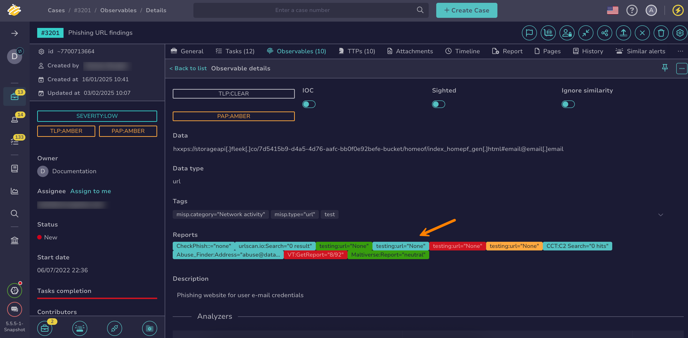

# Import Observables from Analyzer Reports

<!-- md:permission `manageObservable` -->

[Cortex analyzers](../../../../administration/cortex/about-cortex.md) enrich observables with detailed contextual intelligence, generating a report with the results, which may include additional observables.

Import [observables](about-observables.md) from analyzer reports in TheHive to add additional observables discovered during analysis to your case or alert.

<h2>Procedure</h2>

1. [Locate the observable](../search-for-cases/find-an-observable.md) on which you ran the analyzer.

2. In the observable details, select the relevant report in the **Reports** section.

    

3. In the **Analysis report** drawer, under the **Observables extracted from analysis report** section, select :fontawesome-regular-square: next to the observables you want to import.

4. Select **Import observables**.

5. In the **Adding an observable** drawer, review the prefilled information.

6. Select **Confirm**.

<h2>Next steps</h2>

* [Add an Observable](add-an-observable.md)
* [Delete an Observable](delete-an-observable.md)
* [Update the Status of an Observable](update-an-observable-status.md)
* [Edit Multiple Observables](edit-multiple-observables.md)
* [Pin an Observable](pin-an-observable.md)
* [Export Data from Observables](export-data-observables.md)
* [Run Analyzers and Review Reports for an Observable](run-analyzers-on-an-observable.md)
* [Run Responders and Review Reports for an Observable](run-responders-on-an-observable.md)
* [Exclude an Observable from Similarity Checks](exclude-an-observable-from-similarity-checks.md)