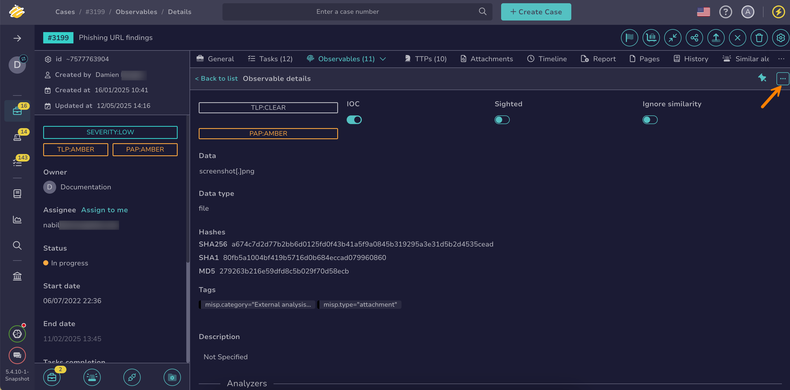
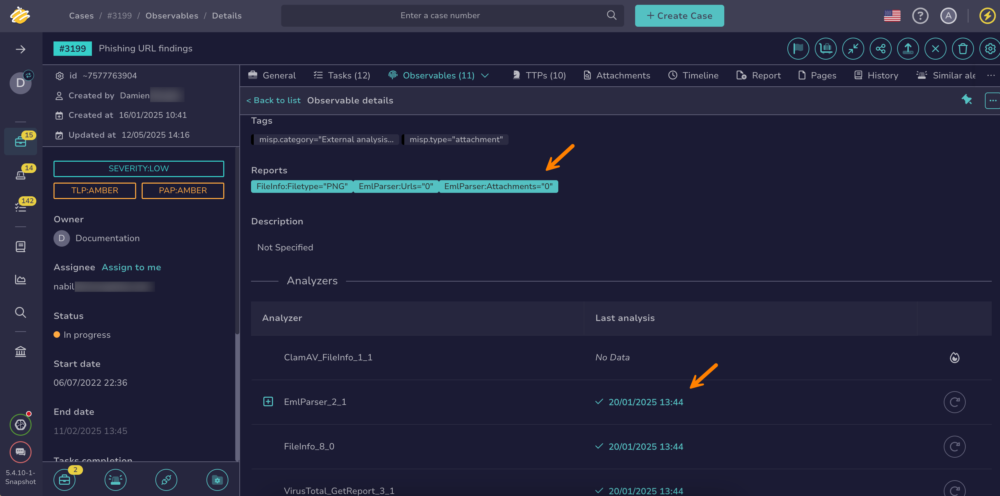

# How to Run Analyzers and Review Reports for an Observable

This topic provides step-by-step instructions for running [analyzers](../../../../administration/cortex/about-cortex.md) on an [observable](about-observables.md) and reviewing analyzer reports in TheHive.

Analyzers enrich observables with detailed, contextual intelligence, generating a report with the results. The type of each observable determines which analyzers are available.

{!includes/access-manage-observables.md!}

## Run analyzers on an observable

1. [Locate the observable](../search-for-cases/find-an-observable.md) on which you want to run analyzers.

2. In the observable, select :fontawesome-solid-ellipsis:.

    

3. Select **Run analyzers**.

4. In the **Analyzer** drawer, select the analyzers you want to run.

    !!! tip "Can't find an analyzer?"
        If you can't find the analyzer you need, it might not be available for this observable type. Contact someone with admin-level permissions on Cortex to [change the types associated with the analyzer](../../../../../cortex/api/how-to-create-an-analyzer.md).

5. Select **Run selected analyzers**.

## Review analyzer reports for an observable

1. [Locate the observable](../search-for-cases/find-an-observable.md) on which you ran analyzers.

2. In the observable details, move through the **Reports** section to select a report, or move through the **Analyzers** section and select any green item in the **Last analysis** column.

    

3. Optional: Import observables from reports. See [Import Observables from Analyzer Reports](import-observables-from-analyzer-reports.md) for detailed instructions.

<h2>Next steps</h2>

* [Add an Observable](add-an-observable.md)
* [Remove an Observable](remove-an-observable.md)
* [Update the Status of an Observable](update-an-observable-status.md)
* [Edit Multiple Observables](edit-multiple-observables.md)
* [Pin an Observable](pin-an-observable.md)
* [Export Data from Observables](export-data-observables.md)
* [Run Responders and Review Reports for an Observable](run-responders-on-an-observable.md)
* [Import Observables from Analyzer Reports](import-observables-from-analyzer-reports.md)
* [Exclude an Observable from Similarity Checks](exclude-an-observable-from-similarity-checks.md)