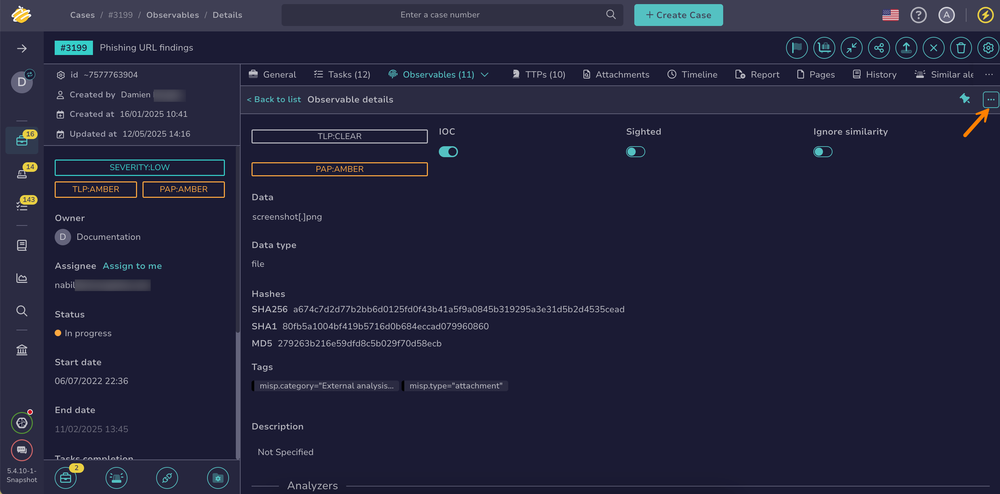

# How to Run Responders on an Observable

This topic provides step-by-step instructions for running [responders](../../../../administration/cortex/about-cortex.md) on an [observable](about-observables.md) in TheHive.

Responders execute actions on cases, alerts, observables, tasks, and task logs to support investigations and incident response.

{!includes/access-manage-observables.md!}

<h2>Procedure</h2>

1. [Locate the observable](../search-for-cases/find-an-observable.md) on which you want to run the responders.

2. In the observable details, select :fontawesome-solid-ellipsis:.

    

3. Select **Responders**.

4. In the **Run actions on current observable** drawer, select the responders you want to run.

5. Select **Launch actions**.

6. Select **Confirm**.

<h2>Next steps</h2>

* [Add an Observable](add-an-observable.md)
* [Remove an Observable](remove-an-observable.md)
* [Update the Status of an Observable](update-an-observable-status.md)
* [Edit Multiple Observables](edit-multiple-observables.md)
* [Pin an Observable](pin-an-observable.md)
* [Export Data from Observables](export-data-observables.md)
* [Run Analyzers on an Observable](run-analyzers-on-an-observable.md)
* [Import Observables from Analyzer Reports](import-observables-from-analyzer-reports.md)
* [Exclude an Observable from Similarity Checks](exclude-an-observable-from-similarity-checks.md)