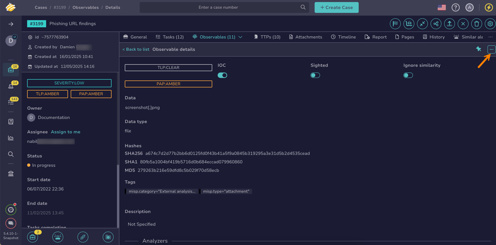
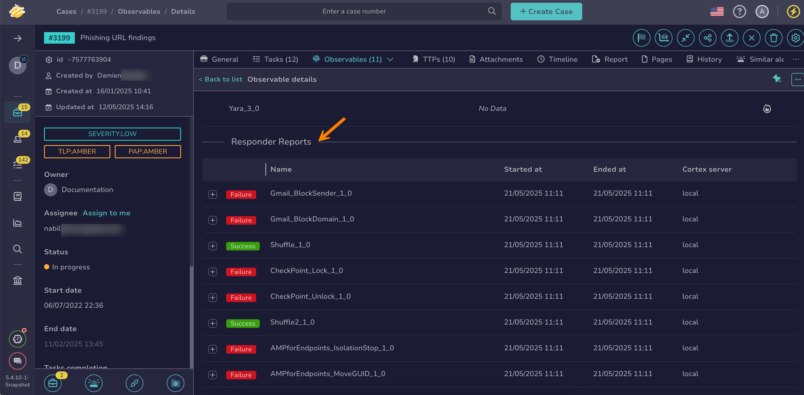

# Run Responders and Review Reports for an Observable

<!-- md:permission `manageObservable` -->

[Cortex responders](../../../../administration/cortex/about-cortex.md) execute actions on cases, alerts, observables, tasks, and task logs.

Run responders on an [observable](about-observables.md) in TheHive to execute automated actions such as blocking an IP address on the firewall or a URL on the proxy.

Only responders that match the observables' type, as well as their TLP (traffic light protocol) and PAP (permissible actions protocol) levels, are available.

## Run responders on an observable

!!! tip "<!-- md:version 5.7 --> Bulk run"
    To run responders on multiple observables, go to the **Observables** tab in a case or alert and select :fontawesome-regular-square: next to each observable you want to include. Then select :fontawesome-solid-gear: above the list.

1. [Locate the observable](../search-for-cases/find-an-observable.md) on which you want to run responders.

2. In the observable, select :fontawesome-solid-ellipsis:.

    

3. Select **Responders**.

4. In the **Run actions on current observable** drawer, select the responders you want to run.

5. Select **Launch actions**.

6. Select **Confirm**.

## Review responder reports for an observable

1. [Locate the observable](../search-for-cases/find-an-observable.md) on which you ran responders.

2. In the observable details, move through the **Responder reports** section to check the status of the executed responders.

    

<h2>Next steps</h2>

* [Add an Observable](add-an-observable.md)
* [Delete an Observable](delete-an-observable.md)
* [Update the Status of an Observable](update-an-observable-status.md)
* [Edit Multiple Observables](edit-multiple-observables.md)
* [Pin an Observable](pin-an-observable.md)
* [Export Data from Observables](export-data-observables.md)
* [Run Analyzers and Review Reports for an Observable](run-analyzers-on-an-observable.md)
* [Import Observables from Analyzer Reports](import-observables-from-analyzer-reports.md)
* [Exclude an Observable from Similarity Checks](exclude-an-observable-from-similarity-checks.md)