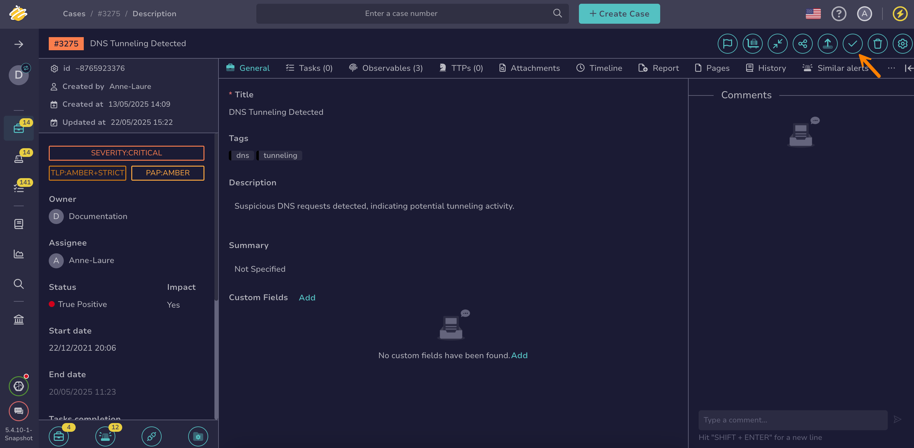

# Reopen a Case

This topic provides step-by-step instructions for reopening a [case](about-cases.md) in TheHive.

Use this procedure to reopen a closed case and change its [status](../../../administration/status/about-statuses.md) so that it moves from the *Closed* stage to the *In progress* stage.

{!includes/access-reopen-cases.md!}

<h2>Procedure</h2>

1. [Find the case](./search-for-cases/find-a-case.md) you want to reopen.

2. In the case, select **Reopen**.

    

3. In the drawer, update the [status](change-status-case.md) for the case.

4. Select **Confirm**.

<h2>Next steps</h2>

* [Change an Case Status](change-status-case.md)
* [Merge Cases](merge-cases.md)