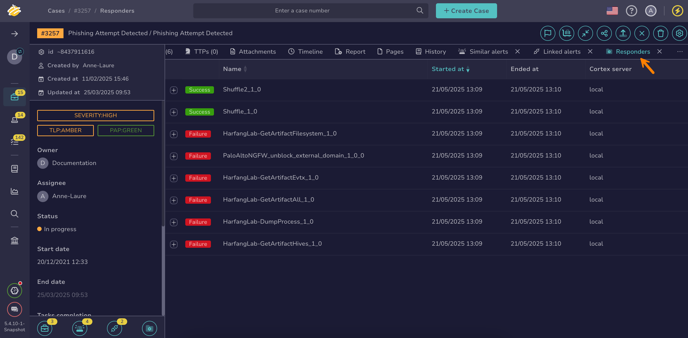

# How to Run Responders and Review Reports for a Case

This topic provides step-by-step instructions for running [responders](../../../../administration/cortex/about-cortex.md) on a [case](about-cases.md) and reviewing responder reports in TheHive.

Responders execute response actions on cases, alerts, observables, tasks, and task logs.

Run a responder on a case to take actions such as closing an external ticket or executing a predefined response within TheHive.

## Run responders on a case

1. [Locate the alert](./search-for-cases/find-a-case.md) on which you want to run responders.

2. In the case, select **Responders**.

    

3. In the drawer, select the responders you want to run.

4. Select **Launch actions**.

5. Select **Confirm**.

## Review responder reports for a case

1. [Locate the case](./search-for-cases/find-a-case.md) on which you ran responders.

2. In the case, select the **Responders** tab to check the status of the executed responders.

    

<h2>Next steps</h2>

