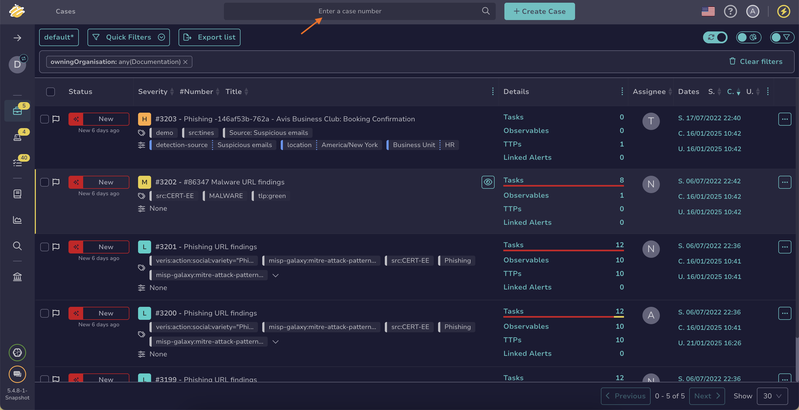
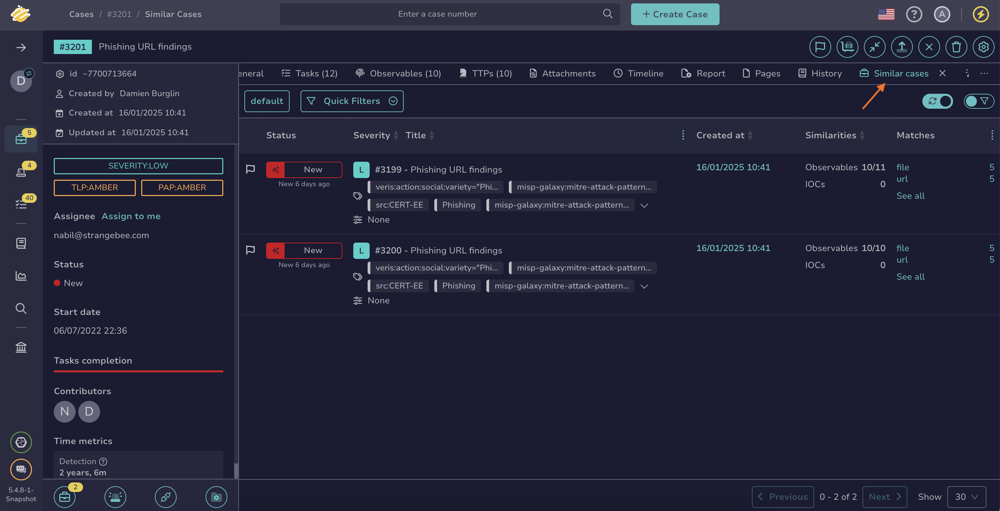
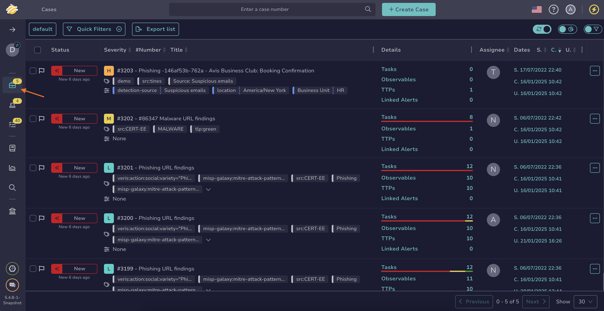
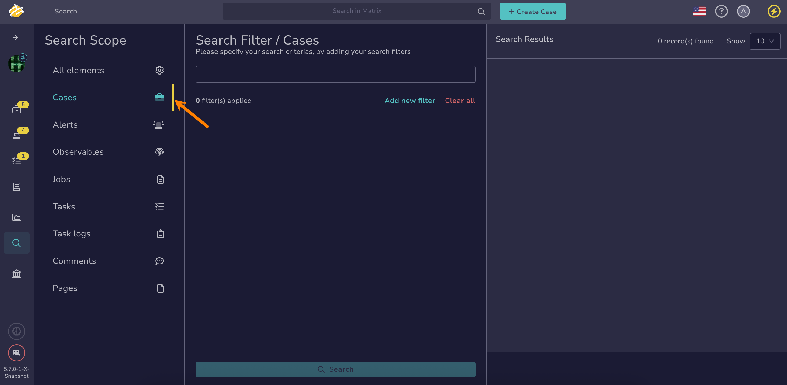

# How to Find a Case

This topic provides step-by-step instructions for using various methods to search for a [case](../about-cases.md) in TheHive.

If you’re unsure which method to use, refer to the [Overview of Search Methods for Cases](overview-search-methods-case.md) topic.

!!! tip "Why can't I find a case?"
    Since TheHive 5.5, [case visibility](../../cases/about-cases.md#case-visibility) can be restricted to protect sensitive data. If you aren't an authorized user, it won't appear in the case list, search results, or dashboards.

## Method 1: Enter a case number search box

*Use this method if you already know the case number you're looking for.*

1. Enter the case number in the search box located at the top of the page, visible across all views.

    

2. Press **Enter** or select :material-magnify:.

3. The case description appears.

---

## Method 2: Similar cases

*Use this method if you want to find one or more cases similar to a known case without needing to perform actions on them simultaneously.*

1. Open a case, an alert, or a task, and select the **Similar cases** tab.

    

2. {!includes/apply-filters.md!}

3. {!includes/search-results.md!}

---

## Method 3: Filters in the Cases view

*Use this method if you want to find one or more cases to perform actions on them simultaneously.*

1. Go to the **Cases** view from the sidebar menu.

    

2. {!includes/apply-filters.md!}

3. {!includes/search-results.md!}

---

## Method 4: Global Search feature

*Use this method if you need to conduct advanced searches for one or more cases without requiring simultaneous actions.*

1. Go to the **Global Search** view from the sidebar menu.

    

2. Select the **Cases** item on the **Search scope** pane.

    

    {!includes/global-search-all-elements.md!}

3. {!includes/global-search-search-box.md!}

4. {!includes/global-search-additional-filters.md!}

5. {!includes/search-results.md!}

## Next steps

* [Actions on Cases](../cases-description/actions.md)
* [Merge Cases](../merge-cases.md)
* [Restrict Case Visibility](../restrict-visibility-case.md)
* [Restore Case Visibility](../restore-visibility-case.md)
* [View a Case](../cases-description/general.md)
* [Adding to a Case (Tags/Tasks/Custom Field Values)](../../cases/adding_to_a_case.md)
* [View Tasks](../cases-description/tasks.md)
* [View Observables](../cases-description/observables.md)
* [View TTPs](../cases-description/ttps.md)
* [View Attachments](../cases-description/attachments.md)
* [View Timeline](../cases-description/timeline.md)
* [View Pages](../cases-description/pages.md)
* [Run Responders on Case](../cases-description/run-responders.md)
* [Run Analyzers on Case](../cases-description/run-analyzer.md)
