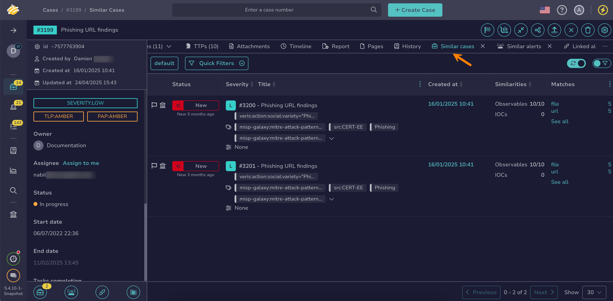

# Find a Case

This topic provides step-by-step instructions for using various methods to search for a [case](../about-cases.md) in TheHive.

If you’re unsure which method to use, refer to the [Overview of Search Methods for Cases](overview-search-methods-case.md) topic.

!!! tip "Can't find a case?"

    * Ensure [autorefresh](../../about-autorefresh.md) is turned on to automatically display new cases in lists.
    * <!-- md:version 5.5 --> [Case visibility](../about-cases.md#case-visibility) can be restricted to protect sensitive data. If you aren't an authorized user, it won't appear in the case list, search results, or dashboards.

## Method 1: Enter a case number search box

*Use this method if you already know the case number you're looking for.*

1. Enter the case number in the search box located at the top of the page, visible across all views.

    

2. Press **Enter** or select :material-magnify:.

3. The case description appears.

---

## Method 2: Similar cases

*Use this method if you want to find one or more cases similar to a known case without needing to perform actions on them simultaneously.*

{!includes/similar-cases-alerts-filters.md!}

1. Open a case, an alert, or a task, and select the **Similar cases** tab.

    

2. {!includes/apply-filters.md!}

3. {!includes/search-results.md!}

For more information, see the [Find Similar Alerts and Cases](../find-similar-alerts-cases.md) topic.

---

## Method 3: Filters in the Cases view

*Use this method if you want to find one or more cases to perform actions on them simultaneously.*

1. Go to the **Cases** view from the sidebar menu.

    

2. {!includes/apply-filters.md!}

    {!includes/views-filters-sorts.md!}

    !!! info "Beta feature available for filters and views"
        <!-- md:version 5.5.5 --> A beta feature to enhance user experience for filters and views is available for testing on lists of cases, alerts, tasks, and observables. For detailed instructions on how to activate this beta feature, see [Activate the Beta of Filters and Views](../../../../user-guides/manage-user-settings.md#activate-the-beta-of-filters-and-views).

3. {!includes/search-results.md!}

---

## Method 4: Global Search feature

*Use this method if you need to conduct advanced searches for one or more cases without requiring simultaneous actions.*

1. Go to the **Global Search** view from the sidebar menu.

    

2. Select the **Cases** item on the **Search scope** pane.

    

    {!includes/global-search-all-elements.md!}

3. Enter the keywords you want to search for in the search box displayed by default.

    !!! tip "<!-- md:version 5.4.7 --> Wildcard character"
        You can use the wildcard character *\** to broaden your searches.

        The wildcard character acts as a placeholder that matches zero or more characters, helping you find variations of a term or incomplete information.
        
        Examples of use cases:

        * Email domains: Entering *\*@gmail.com* will return entities containing the gmail.com domain.
        * IP subnets: Entering *192.168.\*.\** will return entities with IP addresses in the 192.168.x.x subnet.
        * URLs: Entering *https://malwaredomain.com/\** will return entities hosted under the malwaredomain.com directory.

        Other advanced search options, such as Boolean and phrase searches, are not currently supported.

4. {!includes/global-search-additional-filters.md!}

5. {!includes/search-results.md!}

<h2>Next steps</h2>

* [Merge Cases](../merge-cases.md)
* [Restrict Case Visibility](../case-visibility/restrict-visibility-case.md)
* [Restore Case Visibility](../case-visibility/restore-visibility-case.md)
* [Add Tasks to a Case](../add-tasks-to-a-case.md)
* [Add Custom Fields](../custom-fields/add-custom-fields.md)
* [Find Similar Alerts or Cases](../find-similar-alerts-cases.md)
* [Add TTPs](../ttps/add-ttps.md)
* [Add an Attachment](../attachments/add-an-attachment-case-alert.md)
* [View a Case Timeline](../case-timelines/view-case-timeline.md)
* [View a Knowledge Base Page](../../../../user-guides/knowledge-base/view-a-knowledge-base-page.md#view-a-page-at-the-case-level)
* [Run Responders and Review Reports for a Case](../run-responders-on-a-case.md)
