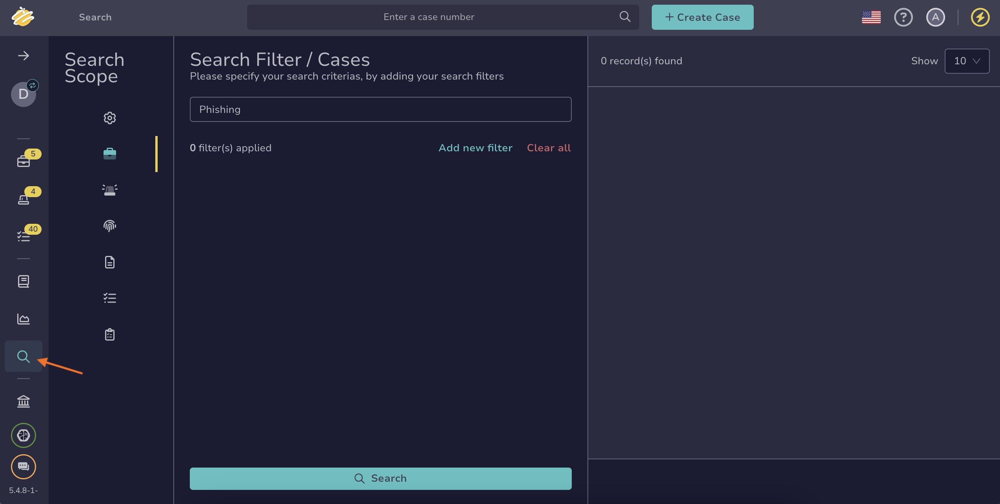
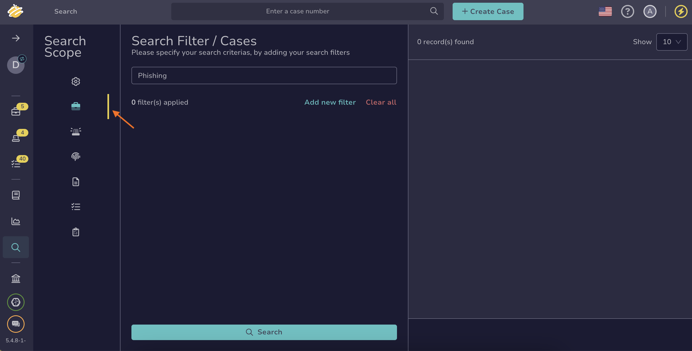

# How to Find a Case

This topic provides step-by-step instructions for using various methods to search for a case in TheHive.

If you’re unsure which method to use, refer to the [Overview of Search Methods for Cases](overview-search-methods-case.md) topic.

## Method 1: Enter a case number search box

*Use this method if you already know the case number you're looking for.*

1. Enter the case number in the search box located at the top of the page, visible across all views.

    

2. Press **Enter** or select :material-magnify:.

3. The case description is displayed.

---

## Method 2: Similar cases

*Use this method if you want to find one or more cases similar to a known case without needing to perform actions on them simultaneously.*

1. Open a case, an alert, or a task, and select the **Similar cases** tab.

    

2. {!includes/apply-filters.md!}

3. {!includes/search-results-cases.md!}

---

## Method 3: Filters in the cases view

*Use this method if you don't know the case number you're looking for or need to search for multiple cases to perform actions on them simultaneously.*

1. Go to the **Cases** view from the sidebar menu.

    

2. {!includes/apply-filters.md!}

3. {!includes/search-results-cases.md!}

---

## Method 4: Global Search feature

*Use this method if you don't know the case number you're looking for or need to conduct advanced searches for multiple cases without requiring simultaneous actions.*

1. Go to the **Global Search** view from the sidebar menu.

    

2. Select the **Cases** item on the **Search scope** pane.

    

    !!! note "All elements"
        Select the **All elements** item for a comprehensive tool-wide overview that encompasses all entity types (cases, alerts, observables, jobs, tasks, and task logs), to analyze cross-linked information, or to conduct a detailed investigation.

3. Enter the keywords you want to search for in the search box displayed by default.

    !!! tip "Wildcard character"
        You can use the wildcard character *\** to broaden your searches and capture multiple variations since version 5.4.7.
        
        Examples of use cases:  
        - Email domains: Entering *\*@gmail.com* will return entities containing the gmail.com domain.  
        - IP subnets: Entering *192.168.\*.\** will return entities with IP addresses in the 192.168.x.x subnet.  
        - URLs: Entering *https://malwaredomain.com/\** will return entities hosted under the malwaredomain.com directory.

        Other advanced search options, such as Boolean and phrase searches, are not supported.

    !!! info "Help"
        If you can't find what you're looking for using the Global Search feature and want to learn more about how fields are indexed for search, refer to the [Search Indexation Modes](thehive/user-guides/analyst-corner/search-methods/search-indexation-modes.md) topic.

4. If you need additional filters, apply one or more filters by selecting **Add new filter**. These filters refine your search results and act as an equivalent to the AND operator in Boolean search.

    !!! warning
        Filters are required for the following fields to ensure the search engine accurately interprets values:  
        - Fields with specific date formats  
        - [Custom fields](../../../../administration/custom-fields/about-custom-fields.md)

5. {!includes/search-results-cases.md!}

## What's next?

* [Actions on Cases](../../cases-list/actions.md)
* [View a Case](../../cases-list/general.md)
* [Adding to a Case (Tags/Tasks/Custom Field Values)](../../cases/adding_to_a_case.md)
* [View Tasks](../../cases-list/tasks.md)
* [View Observables](../../cases-list/observables.md)
* [View TTPs](../../cases-list/ttps.md)
* [View Attachments](../../cases-list/attachments.md)
* [View Timeline](../../cases-list/timeline.md)
* [View Pages](../../cases-list/pages.md)
* [Run Responders on Case](../../cases-list/run-responders.md)
* [Run Analyzers on Case](../../cases-list/run-analyzer.md)
