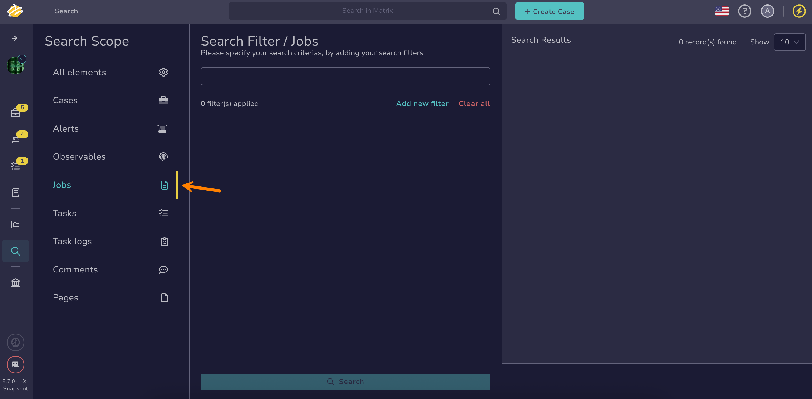

# How to Find a Job

This topic provides step-by-step instructions for searching a job in TheHive.

A job is a task initiated by Cortex to run an [analyzer](../../../../../cortex/installation-and-configuration/analyzers-responders.md) on an observable.

!!! tip "Why can't I find a job?"
    Since TheHive 5.5, [case visibility](../about-cases.md#case-visibility) can be restricted to protect sensitive data. If you aren't an authorized user, its linked observables and any jobs launched on those observables won't appear in the list, search results, or dashboards.

<h2>Procedure</h2>

1. Go to the **Global Search** view from the sidebar menu.

    

2. Select the **Jobs** item on the **Search scope** pane.

    

    {!includes/global-search-all-elements.md!}

3. {!includes/global-search-search-box.md!}

    !!! warning "Warning"
        The `workerDefinition` field and the `operations[]` array aren't indexed for search.

4. {!includes/global-search-additional-filters.md!}

5. {!includes/search-results.md!}

<h2>Next steps</h2>

* [Run Analyzers on Case](../cases-description/run-analyzer.md)
* [Run Responders on Case](../cases-description/run-responders.md)

