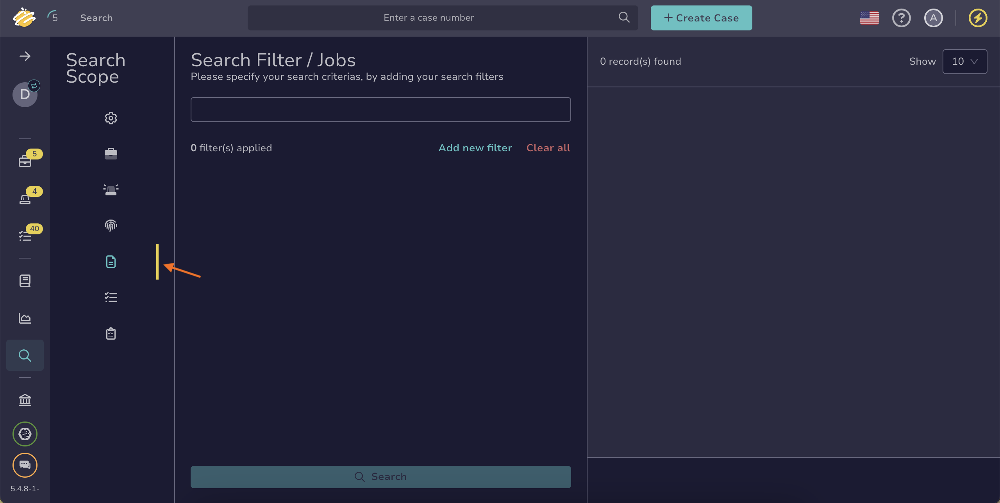

# Find a Job

Search for a job in TheHive to locate tasks initiated by Cortex to run [analyzers](../../../../../cortex/installation-and-configuration/analyzers-responders.md) on observables.

!!! tip "Can't find a job?"
    <!-- md:version 5.5 --> <!-- md:license Platinum --> [Case visibility](../about-cases.md#case-visibility-restriction) can be restricted to protect sensitive data. If you aren't an authorized user, its linked observables and any jobs launched on those observables won't appear in the list, search results, or dashboards.

## Method 1: Search bar

<!-- md:version 5.6 -->

*Simple searches for one or more jobs without requiring simultaneous actions.*

1. In the search bar at the top of the page, enter your search text.

    

    

    

2. Select a result from the list, or choose **All results** to view the full set of matches.

!!! note "Refine results"
    The search bar searches across all element types—cases, alerts, observables, tasks, task logs, and jobs. It also doesn't support filters.  

    Use the [Global Search feature](#method-2-global-search-feature) when you need to refine results more precisely.

---

## Method 2: Global Search feature

*If you need to conduct advanced searches for one or more jobs without requiring simultaneous actions.*

1. Go to the **Global Search** view from the sidebar menu.

    

2. Select the **Jobs** item on the **Search scope** pane.

    

    

3. Enter the keywords you want to search for in the search box displayed by default.

    

    !!! warning "Unindexed fields"
        The `workerDefinition` field and the `operations[]` array aren't indexed for search.

    

4. 

5. 

<h2>Next steps</h2>

* [Run Analyzers and Review Reports for an Observable](../observables/run-analyzers-on-an-observable.md)
* [Run Responders and Review Reports for an Observable](../observables/run-responders-on-an-observable.md)
* [Run Responders and Review Reports for a Case](../run-responders-on-a-case.md)