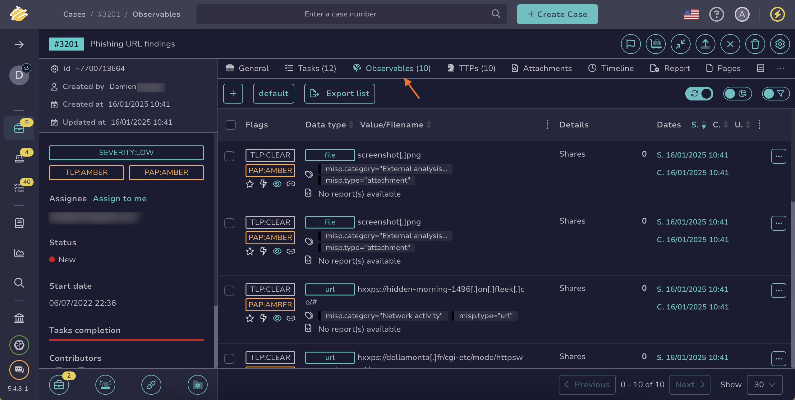
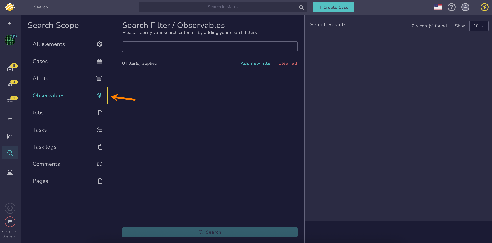

# How to Find an Observable

This topic provides step-by-step instructions for searching an [observable](../observables/about-observables.md) in TheHive.

!!! tip "Can't find an observable?"

    * Ensure [autorefresh](../../about-autorefresh.md) is turned on to automatically display new observables in lists.
    * <!-- md:version 5.5 --> [Case visibility](../about-cases.md#case-visibility) can be restricted to protect sensitive data. If you aren't an authorized user, its linked observables won't appear in the list, search results, or dashboards.

## Method 1: Observables tab in cases and alerts descriptions

*Use this method if you know the case or alert containing the observable you're looking for and if you need to perform actions on one or more observables simultaneously.*

1. Open a case or an alert, and select the **Observables** tab.

    

2. {!includes/apply-filters-light.md!}

3. {!includes/search-results.md!}

{!includes/views-filters-sorts.md!}

---

## Method 2: Global Search feature

*Use this method if you’re unsure where to find the observable you’re looking for or if you need to conduct advanced searches for one or more observables without requiring simultaneous actions.*

1. Go to the **Global Search** view from the sidebar menu.

    

2. Select the **Observables** item on the **Search scope** pane.

    

    {!includes/global-search-all-elements.md!}

3. Enter the keywords you want to search for in the search box displayed by default.

    !!! tip "<!-- md:version 5.4.7 --> Wildcard character"
        You can use the wildcard character *\** to broaden your searches.

        The wildcard character acts as a placeholder that matches zero or more characters, helping you find variations of a term or incomplete information.
        
        Examples of use cases:

        * Email domains: Entering *\*@gmail.com* will return entities containing the gmail.com domain.
        * IP subnets: Entering *192.168.\*.\** will return entities with IP addresses in the 192.168.x.x subnet.
        * URLs: Entering *https://malwaredomain.com/\** will return entities hosted under the malwaredomain.com directory.

        Other advanced search options, such as Boolean and phrase searches, are not currently supported.

    {!includes/elasticsearch-limitation.md!}

4. {!includes/global-search-additional-filters.md!}

5. {!includes/search-results.md!}

<h2>Next steps</h2>

* [Remove an Observable](../observables/remove-an-observable.md)
* [Update the Status of an Observable](../observables/update-an-observable-status.md)
* [Edit Multiple Observables](../observables/edit-multiple-observables.md)
* [Pin an Observable](../observables/pin-an-observable.md)
* [Export Data from Observables](../observables/export-data-observables.md)
* [Run Analyzers and Review Reports for an Observable](../observables/run-analyzers-on-an-observable.md)
* [Run Responders and Review Reports for an Observable](../observables/run-responders-on-an-observable.md)
* [Import Observables from Analyzer Reports](../observables/import-observables-from-analyzer-reports.md)