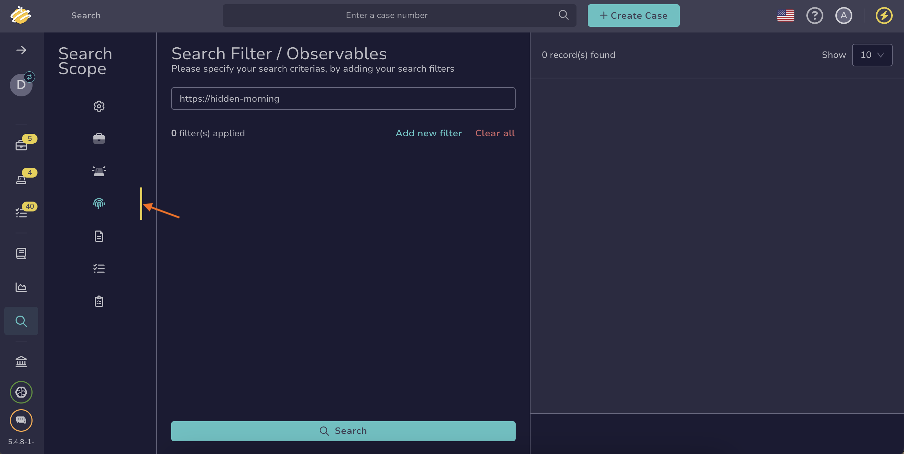

# Find an Observable

Search for [observables](../observables/about-observables.md) in TheHive to investigate indicators of compromise and analyze threat data.

!!! tip "Can't find an observable?"

    * Ensure [autorefresh](../../about-autorefresh.md) is turned on to automatically display new observables in lists.
    * <!-- md:version 5.5 --> <!-- md:license Platinum --> [Case visibility](../about-cases.md#case-visibility-restriction) can be restricted to protect sensitive data. If you aren't an authorized user, its linked observables won't appear in the list, search results, or dashboards.

## Method 1: Search bar

<!-- md:version 5.6 -->

*If you’re unsure where to find the observable you’re looking for or if you need to conduct simple searches for one or more observables without requiring simultaneous actions.*

1. In the search bar at the top of the page, enter your search text.

    

    

    

2. Select a result from the list, or choose **All results** to view the full set of matches.

!!! note "Refine results"
    The search bar searches across all element types—cases, alerts, observables, tasks, task logs, and jobs. It also doesn't support filters.  

    Use the [Global Search feature](#method-3-global-search-feature) when you need to refine results more precisely.

---

## Method 2: Observables tab in cases and alerts descriptions

*If you know the case or alert containing the observable you're looking for and if you need to perform actions on one or more observables simultaneously.*

1. Open a case or an alert, and select the **Observables** tab.

    

2. 

    

3. 

---

## Method 3: Global Search feature

*If you’re unsure where to find the observable you’re looking for or if you need to conduct advanced searches for one or more observables without requiring simultaneous actions.*

1. Go to the **Global Search** view from the sidebar menu.

    

2. Select the **Observables** item on the **Search scope** pane.

    

    

3. Enter the keywords you want to search for in the search box displayed by default.

    

    

4. 

5. 

<h2>Next steps</h2>

* [Delete an Observable](../observables/delete-an-observable.md)
* [Update the Status of an Observable](../observables/update-an-observable-status.md)
* [Edit Multiple Observables](../observables/edit-multiple-observables.md)
* [Pin an Observable](../observables/pin-an-observable.md)
* [Export Data from Observables](../observables/export-data-observables.md)
* [Run Analyzers and Review Reports for an Observable](../observables/run-analyzers-on-an-observable.md)
* [Run Responders and Review Reports for an Observable](../observables/run-responders-on-an-observable.md)
* [Import Observables from Analyzer Reports](../observables/import-observables-from-analyzer-reports.md)