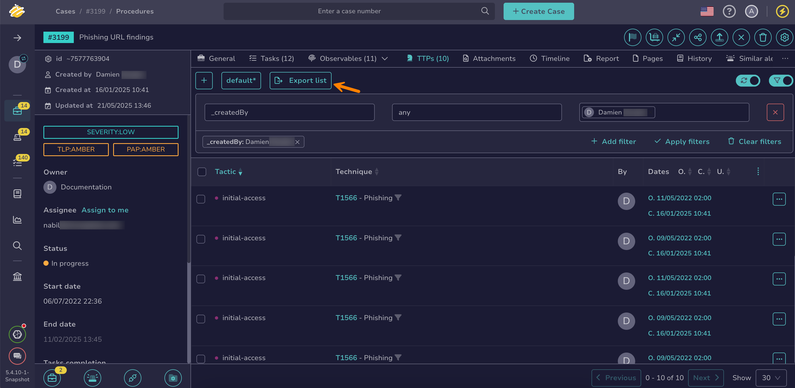

# Export Tactics, Techniques and Procedures

Export [tactics, techniques and procedures (TTPs)](about-ttps.md) from a case or an alert in TheHive.

TTPs describe the behaviors and methods commonly used by specific threat actors or groups.

<h2>Procedure</h2>

1. [Find the case](../search-for-cases/find-a-case.md) or [the alert](../../alerts/search-for-alerts/find-an-alert.md) where you want to export TTPs.

2. {!includes/ttps-tab-go-to.md!}

3. Select **Export list** to export all TTPs displayed in the tab, reflecting the applied [filters and sorting](../../about-filtering-and-sorting.md). To export a specific selection of TTPs, select :fontawesome-regular-square: next to the TTPs you want to export, then select **Export selection**.

    

4. In the **Export TTP to file** drawer, select your preferred formatting options.

5. Select **Export to file**.

<h2>Next steps</h2>

* [Add TTPs](add-ttps.md)
* [Remove TTPs](remove-ttps.md)