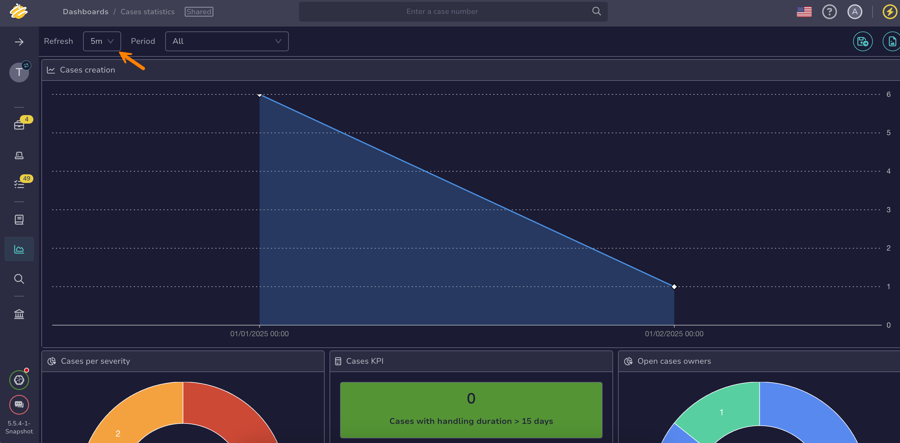

# How to Adjust Dashboard Refresh Frequency

This topic provides step-by-step instructions for adjusting [dashboard](about-dashboards.md) refresh frequency in TheHive.

If you need to pause dashboard refresh and prevent users from re-enabling it due to performance issues, see [Pause Dashboard Refresh](../../organization/configure-organization/manage-ui-configuration/pause-dashboard-refresh.md).

<h2>Procedure</h2>

1. {!includes/dashboards-view-go-to.md!}

2. On the dashboards list, select the name of your dashboard.

    {!includes/filters-sorts-views.md!}

3. Select the desired frequency from the **Refresh** dropdown list.

    

<h2>Next steps</h2>