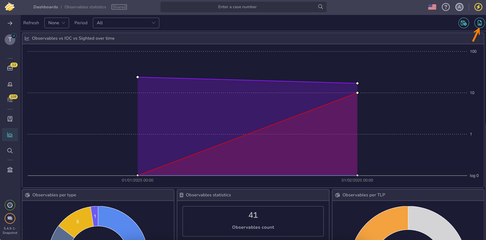

# Download a Dashboard

Download a [dashboard](about-dashboards.md) in TheHive as a PNG image for sharing or documentation purposes. Individual [widgets](widgets-dashboards.md) can be downloaded as PNG or CSV files.

To download your dashboard in JSON format, refer to [Export a Dashboard](export-import-a-dashboard.md#export-a-dashboard).

<h2>Procedure</h2>

1. 

2. On the dashboards list, select the name of your dashboard.

    

3. Select the **Export** symbol at the top right of the page to export the entire dashboard as a PNG image.

    

4. Hover below the widget title and select **Download as PNG** or **Download as CSV**.

    

<h2>Next steps</h2>

* [Widgets in Dashboards](widgets-dashboards.md)
* [Create a Dashboard](create-a-dashboard.md)
* [Add or Remove Widgets in a Dashboard](add-remove-widgets-dashboard.md)
* [Change the Visibility of a Dashboard](change-visibility-of-a-dashboard.md)
* [Adjust Dashboard Refresh Frequency](adjust-dashboard-refresh-frequency.md)
* [Set a Dashboard Display Period](set-dashboard-display-period.md)
* [Delete a Dashboard](delete-a-dashboard.md)