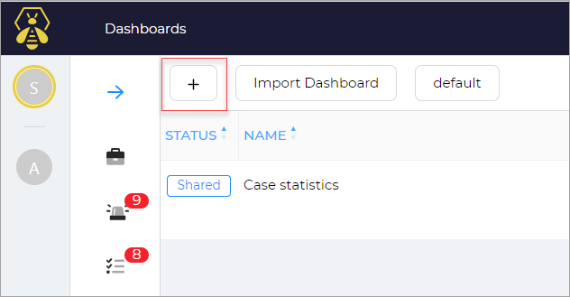
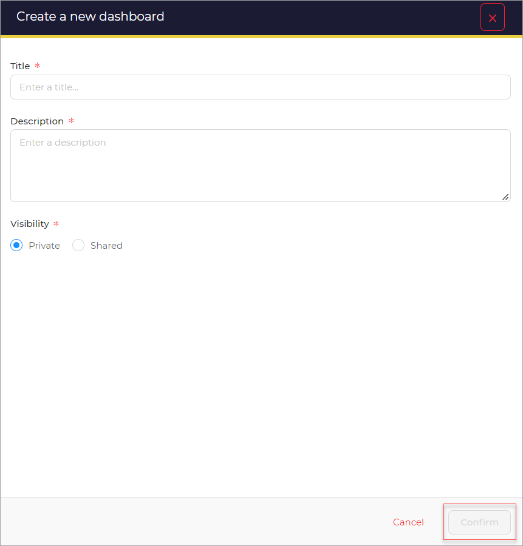
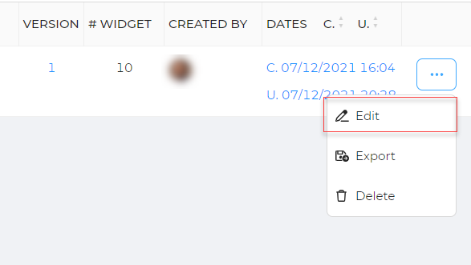
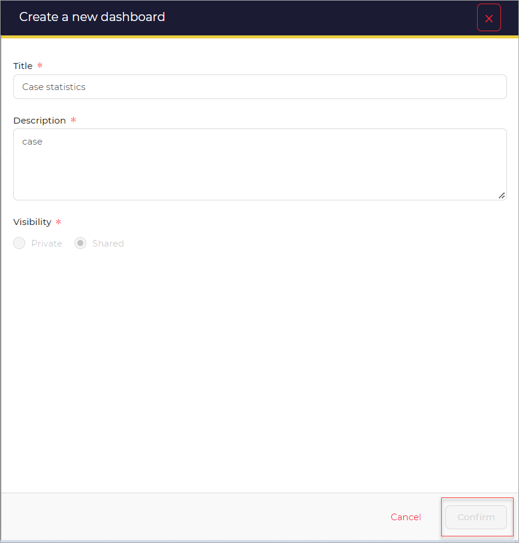
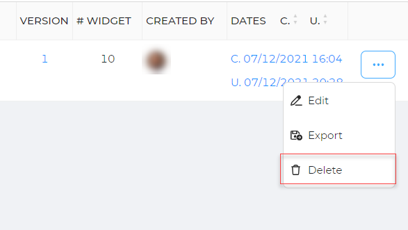
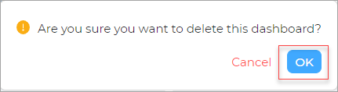
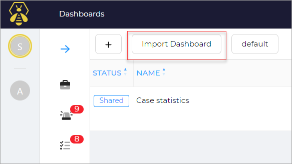
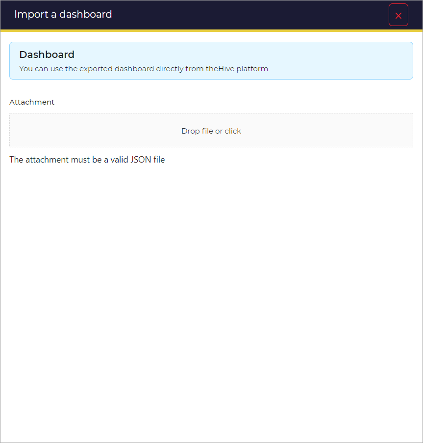
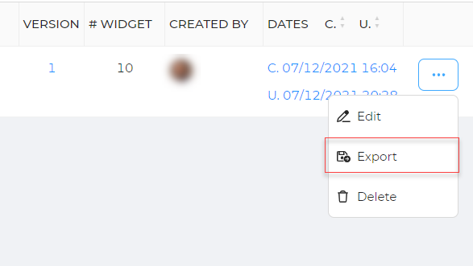

# Manage Dashboard

In this section you can find information about managing dashboards.

### Add a dashboard

To Add a dashboard: 

1. Click the **+** , to **Add** a dashboard. 

    

    A new window opens. 

1. Enter the  **Title**.
1. Enter the  **Description.**
1. Select the **Visibility** option. (Private or Shared) 
1. Click the **confirm** button. 

### Edit a dashboard

To Edit a dashboard: 

1. Click the **Edit** option from the list. 

    

    A new window opens. 

1. Edit the required fields.    
1. Click the **Confirm** button. 

### Delete a dashboard

To Delete a dashboard: 

1. Click the **Delete** option from the list.

    

    A new message pops-up.

1. Click **OK** to delete the dashboard from the list.

### Import a dashboard

To Import a dashboard: 

1. Click the **Import dashboard** option. 

    

    A new window opens. 

1. Click the **Drop file or Click** option in attachment. 

> NOTE: The file must be a valid JSON file. You can use the exported dashboard directly from theHive platform. 

### Export a dashboard

To Export a dashboard: 

1. Click the **Export** option.
1. A file is downloaded, that can be exported/sent.

