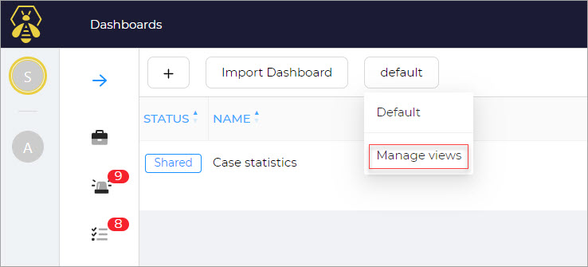
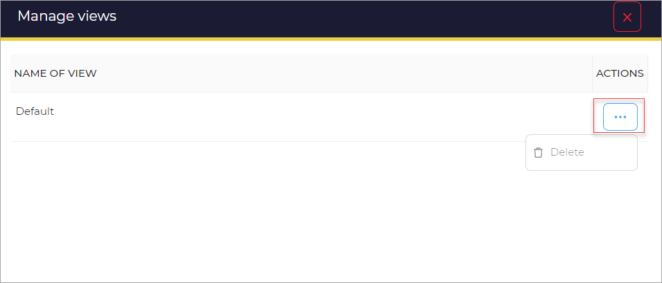

# Manage Views

In this section, you can find information about managing dashboard views.  

To manage views: 

1. Click the default button. 
1. Click the **Manage Views** from the list. 

A new page opens. 

It has the **Name of the view** and the corresponding **Actions**. 

1. Click the ellipsis **(...)** corresponding to the name of the view that you want to delete. 
1. Click Delete.

