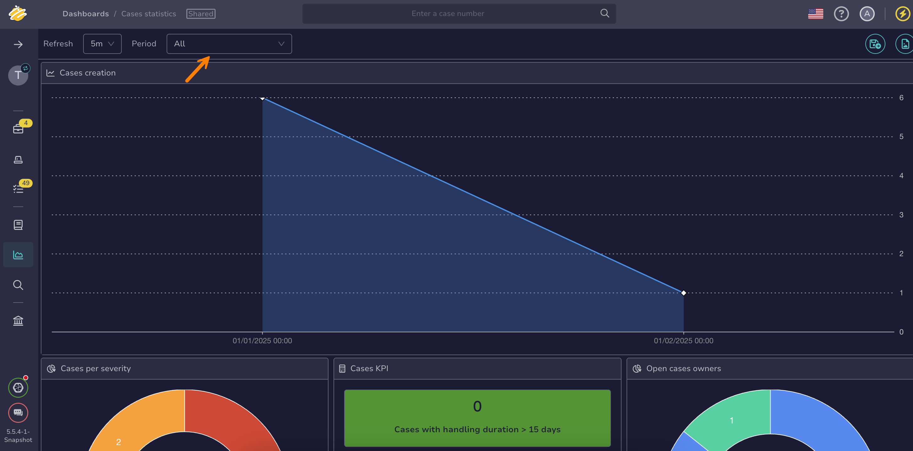

# How to Set the Dashboard Display Period

This topic provides step-by-step instructions for setting the display period of a [dashboard](about-dashboards.md) in TheHive.

If you need to remove the **All periods** option due to performance issues, see [Remove the All Periods Option](../../organization/configure-organization/manage-ui-configuration/remove-all-periods-option.md).

<h2>Procedure</h2>

1. {!includes/dashboards-view-go-to.md!}

2. On the dashboards list, select the name of your dashboard.

    {!includes/filters-sorts-views.md!}

3. Select the desired display period from the **Period** dropdown list.

    

<h2>Next steps</h2>