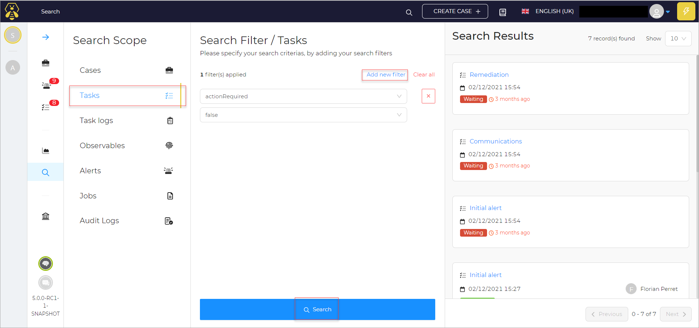

# Search by Tasks

To search by Tasks:

if you want to search based on **Tasks**

1. In the left pane, Click on **Tasks**.  

    You can specify search criterias, by using **Add new filters**. You can use **clear all** to remove any of the applied filters. 

1. Click **Add new filters**. 
1. Select the required filters from the list.
1. Click the **Search** button at the bottom. 

A set of search results appear in the right pane of the page. 

