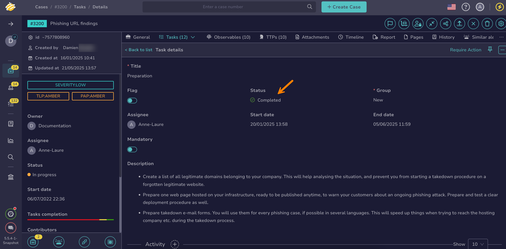

# How to Close a Task

This topic provides step-by-step instructions for closing a [task](about-tasks.md) in TheHive.

Use this procedure to mark the task as *Completed*. For mandatory tasks, [create at least one task log](create-a-task-log.md) before closing. You can continue recording logs even after the task is closed.

{!includes/access-manage-tasks.md!}

<h2>Procedure</h2>

1. [Locate the task](../tasks/search-for-tasks/find-a-task.md) you want to close.

2. In the task details, select the status *Completed*.

    

3. Select **Confirm**.

<h2>Next steps</h2>

* [Export a List of Tasks](export-list-of-tasks.md)