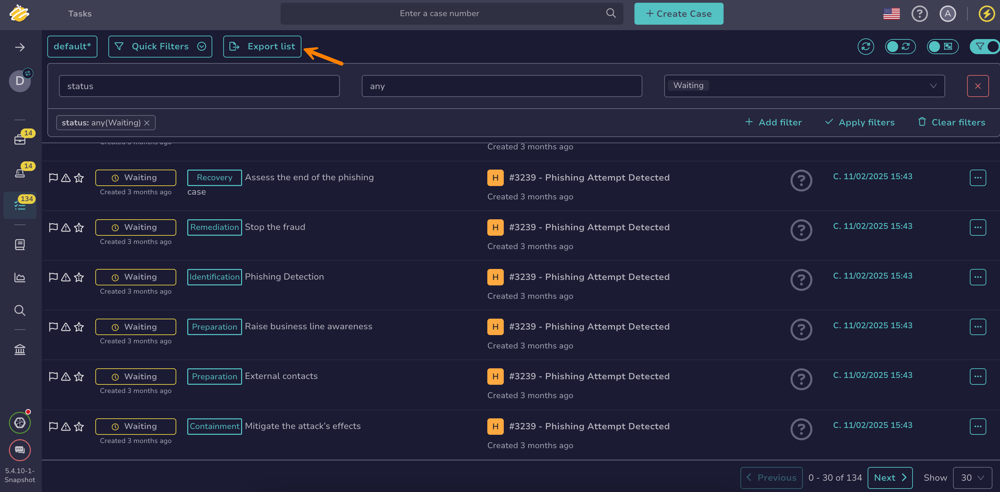

# Export a List of Tasks

This topic provides step-by-step instructions for exporting a list of [tasks](about-tasks.md) in TheHive.

<h2>Procedure</h2>

1. 

2. Select **Export list** to export all displayed tasks, reflecting the applied [filters and sorting](../about-filtering-and-sorting.md). To export a specific selection of tasks, select :fontawesome-regular-square: next to the tasks you want to export, then select **Export selection**.

    

3. In the **Export tasks to file** drawer, select your preferred formatting options.

4. Select **Export to file**.

<h2>Next steps</h2>

* [Change a Task Status](change-task-status.md)
* [Manage a Task](manage-a-task.md)
* [Delete a Task](delete-a-task.md)
* [Create a Task Log](create-a-task-log.md)
* [Delete a Task Log](delete-a-task-log.md)