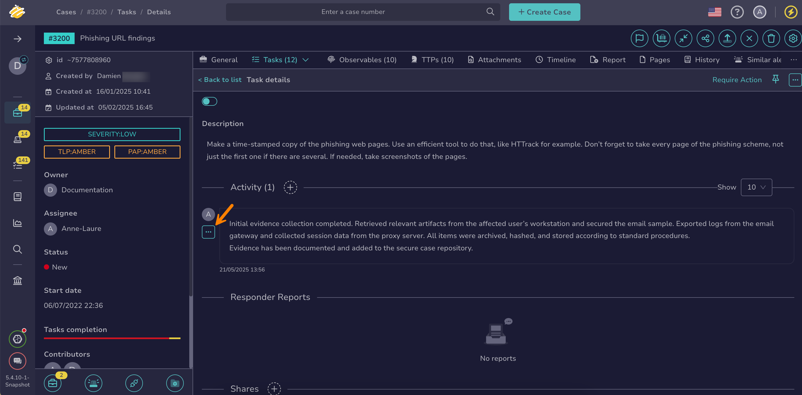

# Run Responders and Review Reports for a Task Log

<!-- md:permission `manageTask` -->

Run [Cortex responders](../../../administration/cortex/about-cortex.md) on a [task log](about-task-logs.md) in TheHive to take automated actions, such as improving its readability or clarity. Responders generate reports documenting the actions taken.

Responders execute actions on cases, alerts, observables, tasks, and task logs.

## Run responders on a task log

1. [Locate the task](./search-for-tasks/find-a-task.md) that contains the task log on which you want to run responders.

2. In the task, move through the **Activity** section and select :fontawesome-solid-ellipsis: next to the relevant task log.

    

3. Select **Responders**.

3. In the **Run actions on current task log** drawer, select the responders you want to run.

4. Select **Launch actions**.

5. Select **Confirm**.

## Review responder reports for a task log

1. [Locate the task](./search-for-tasks/find-a-task-log.md) that contains the task log on which you ran responders.

2. In the task, move through the **Activity** section and select :fontawesome-solid-ellipsis: next to the task log.

    

3. Select **Show responder reports**.

<h2>Next steps</h2>

* [Manage a Task](manage-a-task.md)
* [Run Responders and Review Reports for a Task](run-responders-on-a-task.md)