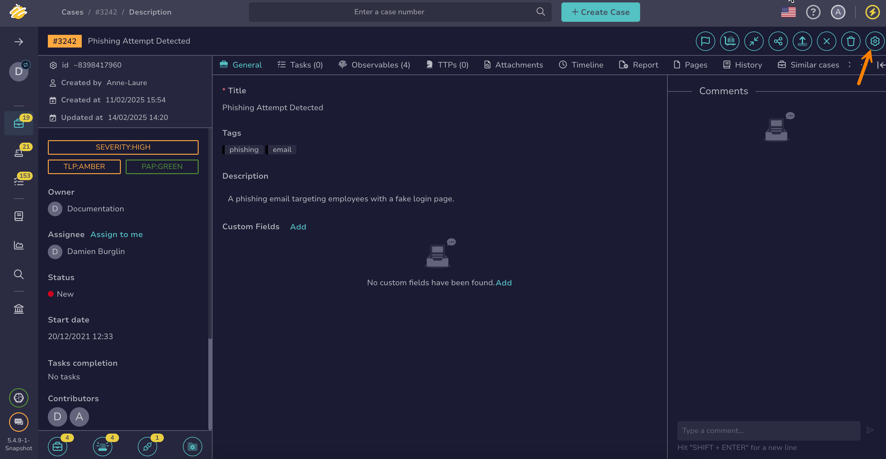
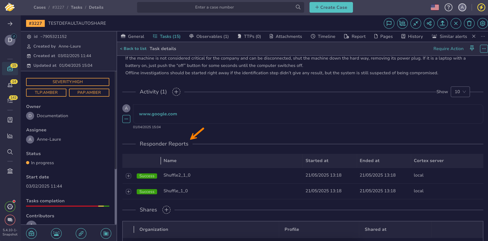

# How to Run Responders and Review Reports for a Task

This topic provides step-by-step instructions for running [responders](../../../administration/cortex/about-cortex.md) on a [task](about-tasks.md) and reviewing responder reports in TheHive.

Responders execute actions on cases, alerts, observables, tasks, and task logs.

Run a responder on a task to take actions such as summarizing task logs.

{!includes/access-manage-tasks.md!}

## Run responders on a task

1. [Locate the task](./search-for-tasks/find-a-task.md) on which you want to run responders.

2. In the task, select **Responders**.

    

3. In the **Run actions on current task** drawer, select the responders you want to run.

4. Select **Launch actions**.

5. Select **Confirm**.

## Review responder reports for a task

1. [Locate the task](./search-for-tasks/find-a-task.md) on which you ran responders.

2. In the task details, move through the **Responder reports** section to check the status of the executed responders.

    

<h2>Next steps</h2>

* [Manage a Task](manage-a-task.md)
* [Run Responders and Review Reports for a Task Log](run-responders-on-a-task-log.md)