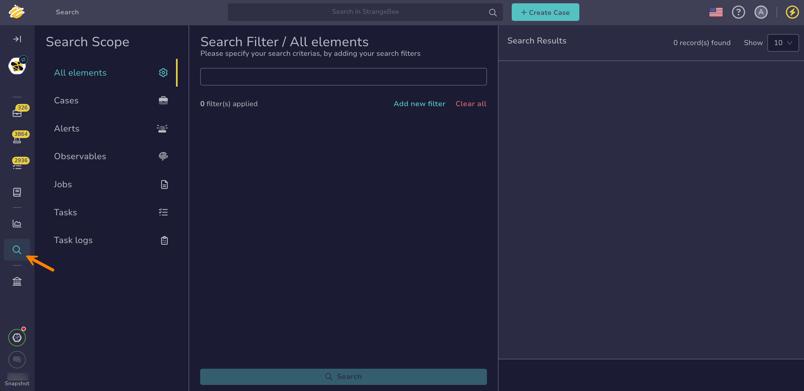
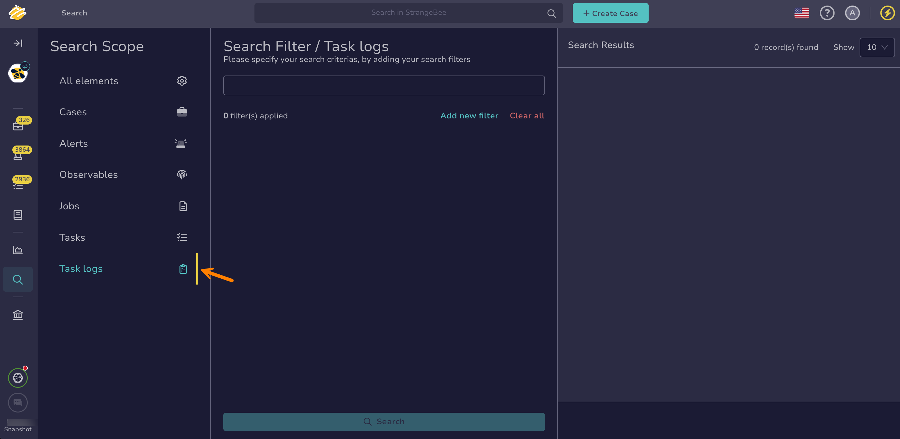

# Find a Task Log

This topic provides step-by-step instructions for searching a task log in TheHive.

A task log is a recorded history of actions, updates, or decisions taken on a specific task. It provides a detailed audit trail that helps track investigation progress, accountability, and compliance.

!!! tip "Can't find a task log?"
    <!-- md:version 5.5 --> [Case visibility](../../cases/about-cases.md#case-visibility) can be restricted to protect sensitive data. If you aren't an authorized user, its linked tasks and task logs won't appear in the list, search results, or dashboards.

<h2>Procedure</h2>

1. Go to the **Global Search** view from the sidebar menu.

    

2. Select the **Task logs** item on the **Search scope** pane.

    

    {!includes/global-search-all-elements.md!}

3. Enter the keywords you want to search for in the search box displayed by default.

    !!! tip "<!-- md:version 5.4.7 --> Wildcard character"
        You can use the wildcard character *\** to broaden your searches.

        The wildcard character acts as a placeholder that matches zero or more characters, helping you find variations of a term or incomplete information.
        
        Examples of use cases:

        * Email domains: Entering *\*@gmail.com* will return entities containing the gmail.com domain.
        * IP subnets: Entering *192.168.\*.\** will return entities with IP addresses in the 192.168.x.x subnet.
        * URLs: Entering *https://malwaredomain.com/\** will return entities hosted under the malwaredomain.com directory.

        Other advanced search options, such as Boolean and phrase searches, are not currently supported.

4. {!includes/global-search-additional-filters.md!}

5. {!includes/search-results.md!}

<h2>Next steps</h2>

* [Delete a Task Log](../delete-a-task-log.md)
* [Run Responders and Review Reports for a Task Log](../../tasks/run-responders-on-a-task-log.md)