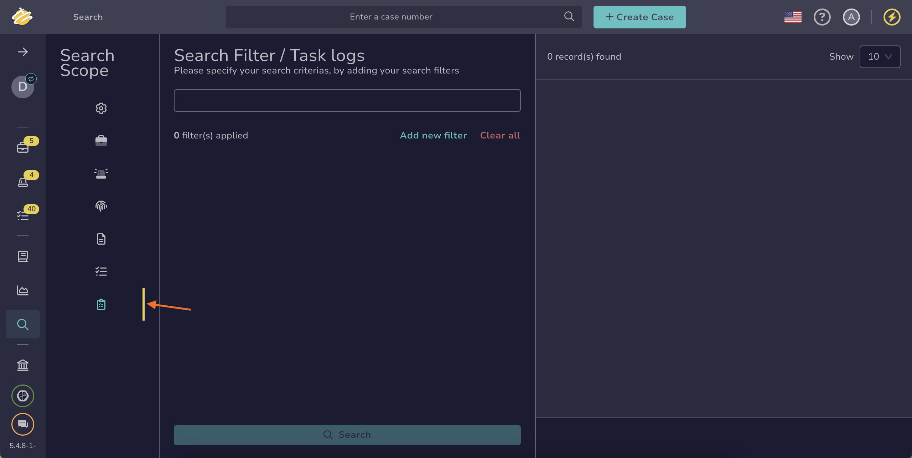

# Find a Task Log

Search for a task log in TheHive to locate specific actions, updates, or decisions recorded for a task. Task logs provide a detailed audit trail that helps track investigation progress, accountability, and compliance.

!!! tip "Can't find a task log?"
    <!-- md:version 5.5 --> [Case visibility](../../cases/about-cases.md#case-visibility) can be restricted to protect sensitive data. If you aren't an authorized user, its linked tasks and task logs won't appear in the list, search results, or dashboards.

<h2>Procedure</h2>

1. Go to the **Global Search** view from the sidebar menu.

    

2. Select the **Task logs** item on the **Search scope** pane.

    

    

3. Enter the keywords you want to search for in the search box displayed by default.

    

    

4. 

5. 

<h2>Next steps</h2>

* [Delete a Task Log](../delete-a-task-log.md)
* [Run Responders and Review Reports for a Task Log](../../tasks/run-responders-on-a-task-log.md)