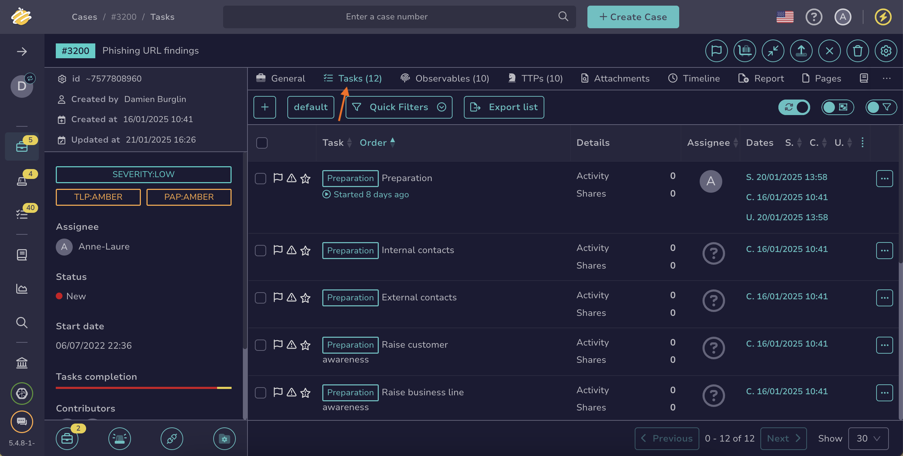
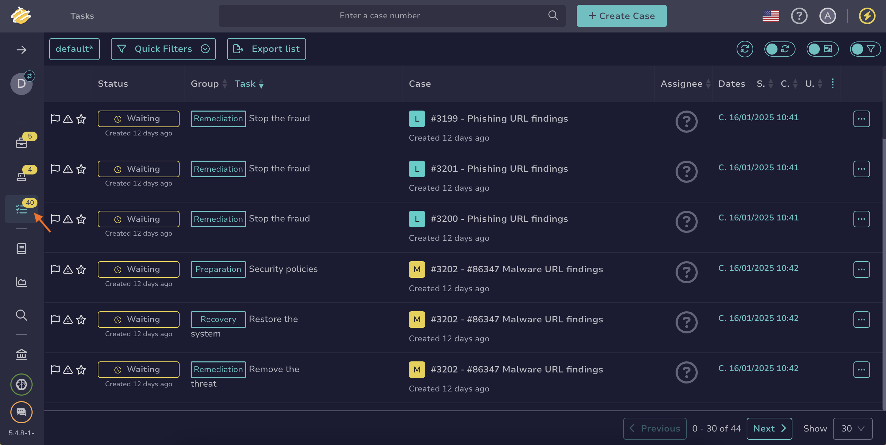
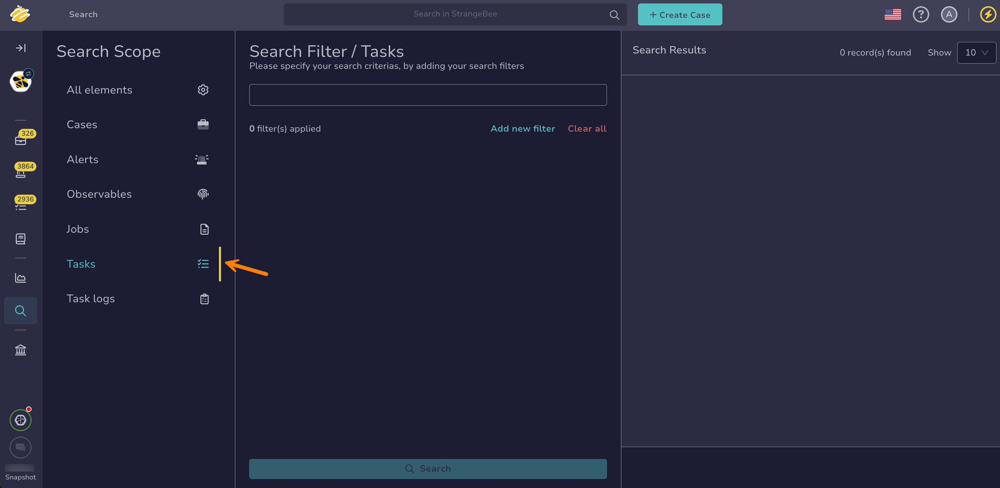

# How to Find a Task

This topic provides step-by-step instructions for using various methods to search for a [task](../about-tasks.md) in TheHive.

If you’re unsure which method to use, refer to the [Overview of Search Methods for Tasks](overview-search-methods-task.md) topic.

!!! tip "Can't find a task?"

    * Ensure [autorefresh](../../about-autorefresh.md) is turned on to automatically display new tasks in lists.
    * <!-- md:version 5.5 --> [Case visibility](../../cases/about-cases.md#case-visibility) can be restricted to protect sensitive data. If you aren't an authorized user, its linked tasks won't appear in the list, search results, or dashboards.

## Method 1: Tasks tab in cases descriptions

*Use this method if you want to find one or more tasks related to a case and want to perform actions on them simultaneously.*

1. Open a case and select the **Tasks** tab.

    

2. {!includes/apply-filters.md!}

    {!includes/views-filters-sorts.md!}

    !!! info "Beta feature available for filters and views"
        <!-- md:version 5.5.5 --> A beta feature to enhance user experience for filters and views is available for testing on lists of cases, alerts, tasks, and observables. For detailed instructions on how to activate this beta feature, see [Activate the Beta of Filters and Views](../../../../user-guides/manage-user-settings.md#activate-the-beta-of-filters-and-views).

3. {!includes/search-results.md!}

!!! tip "Show tasks per group"
    You can display tasks per group to classify them by type, making them easier to find.

---

## Method 2: Filters in the Tasks view

*Use this method if you need to search for one or more tasks without requiring simultaneous actions.*

1. Go to the **Tasks** view from the sidebar menu.

    

2. {!includes/apply-filters.md!}

    {!includes/views-filters-sorts.md!}

    !!! info "Beta feature available for filters and views"
        <!-- md:version 5.5.5 --> A beta feature to enhance user experience for filters and views is available for testing on lists of cases, alerts, tasks, and observables. For detailed instructions on how to activate this beta feature, see [Activate the Beta of Filters and Views](../../../../user-guides/manage-user-settings.md#activate-the-beta-of-filters-and-views).

3. {!includes/search-results.md!}

---

## Method 3: Global Search feature

*Use this method if you need to conduct advanced searches for one or more tasks without requiring simultaneous actions.*

1. Go to the **Global Search** view from the sidebar menu.

    

2. Select the **Tasks** item on the **Search scope** pane.

    

    {!includes/global-search-all-elements.md!}

3. Enter the keywords you want to search for in the search box displayed by default.

    !!! tip "<!-- md:version 5.4.7 --> Wildcard character"
        You can use the wildcard character *\** to broaden your searches.

        The wildcard character acts as a placeholder that matches zero or more characters, helping you find variations of a term or incomplete information.
        
        Examples of use cases:

        * Email domains: Entering *\*@gmail.com* will return entities containing the gmail.com domain.
        * IP subnets: Entering *192.168.\*.\** will return entities with IP addresses in the 192.168.x.x subnet.
        * URLs: Entering *https://malwaredomain.com/\** will return entities hosted under the malwaredomain.com directory.

        Other advanced search options, such as Boolean and phrase searches, are not currently supported.

4. {!includes/global-search-additional-filters.md!}

5. {!includes/search-results.md!}

<h2>Next steps</h2>

* [Create a Task](../create-a-task.md)
* [Share a Task](../share-a-task.md)
* [Change a Task Status](../change-task-status.md)
* [Manage Tasks](../manage-a-task.md)
* [Delete a Task](../delete-a-task.md)
* [Create a Task Log](../create-a-task-log.md)
* [Run Responders and Review Reports for a Task](../../tasks/run-responders-on-a-task.md)
* [Run Responders and Review Reports for a Task Log](../../tasks/run-responders-on-a-task-log.md)