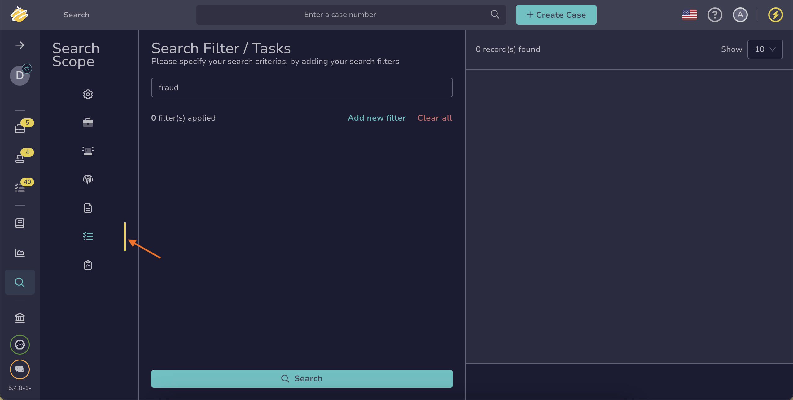

# Find a Task

Search for [tasks](../about-tasks.md) in TheHive to manage investigation workflows and coordinate team activities during incident response.

If you’re unsure which method to use, refer to the [Overview of Search Methods for Tasks](overview-search-methods-task.md) topic.

!!! tip "Can't find a task?"

    * Ensure [autorefresh](../../about-autorefresh.md) is turned on to automatically display new tasks in lists.
    * <!-- md:version 5.5 --> [Case visibility](../../cases/about-cases.md#case-visibility-restriction) can be restricted to protect sensitive data. If you aren't an authorized user, its linked tasks won't appear in the list, search results, or dashboards.

## Method 1: Search bar

<!-- md:version 5.6 -->

*Simple searches for one or more tasks without requiring simultaneous actions.*

1. In the search bar at the top of the page, enter your search text.

    

    

    

2. Select a result from the list, or choose **All results** to view the full set of matches.

!!! note "Refine results"
    The search bar searches across all element types—cases, alerts, observables, tasks, task logs, and jobs. It also doesn't support filters.  

    Use the [Global Search feature](#method-4-global-search-feature) when you need to refine results more precisely.

---

## Method 2: Tasks tab in cases descriptions

*If you want to find one or more tasks related to a case and want to perform actions on them simultaneously.*

1. Open a case and select the **Tasks** tab.

    

2. 

    

3. 

!!! tip "Show tasks per group"
    You can display tasks per group to classify them by type, making them easier to find.

---

## Method 3: Filters in the Tasks view

*If you need to search for one or more tasks without requiring simultaneous actions.*

1. 

2. 

    

3. 

---

## Method 4: Global Search feature

*Advanced searches for one or more tasks without requiring simultaneous actions.*

1. Go to the **Global Search** view from the sidebar menu.

    

2. Select the **Tasks** item on the **Search scope** pane.

    

    

3. Enter the keywords you want to search for in the search box displayed by default.

    

    

4. 

5. 

<h2>Next steps</h2>

* [Create a Task](../create-a-task.md)
* [Share a Task](../share-a-task.md)
* [Change a Task Status](../change-task-status.md)
* [Manage Tasks](../manage-a-task.md)
* [Delete a Task](../delete-a-task.md)
* [Create a Task Log](../create-a-task-log.md)
* [Run Responders and Review Reports for a Task](../../tasks/run-responders-on-a-task.md)
* [Run Responders and Review Reports for a Task Log](../../tasks/run-responders-on-a-task-log.md)