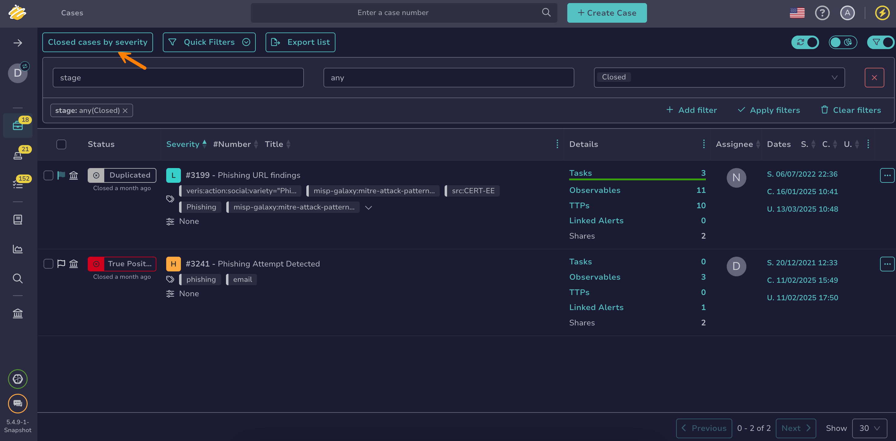

# About Views

Views save [filters and sorting](../about-filtering-and-sorting.md) applied to a list in TheHive.

## Default view

A *Default* view without filters or sorting is always available. Modifying or deleting this view isn't permitted.

## Actions

Users have the ability to [create custom views](create-a-custom-view.md) tailored to their specific needs or [update existing views](update-a-custom-view.md) as necessary. When a view is no longer useful, it can be [deleted](delete-a-custom-view.md) to keep the workspace organized.

To switch between different views, users select the current view.

## Scope

Views apply only to a specific list. They can be private to a user or <!-- md:version 5.6 --> [shared with the entire organization](change-visibility-custom-view.md#share-a-custom-view-with-the-entire-organization).



<!-- md:version 5.6 --> All views persist across devices and browser sessions.

## Behavior

The last used view is automatically applied when accessing a list.

<!-- md:version 5.6 --> Views are sorted alphabetically, and only six views display at once—additional views can be found using the search field.

<h2>Next steps</h2>

* [About Filtering and Sorting](../about-filtering-and-sorting.md)
* [Create a Custom View](create-a-custom-view.md)
* [Update a Custom View](update-a-custom-view.md)
* [Rename a Custom View](rename-a-custom-view.md)
* [Delete a Custom View](delete-a-custom-view.md)
* [Change a Custom View Visibility](change-visibility-custom-view.md)