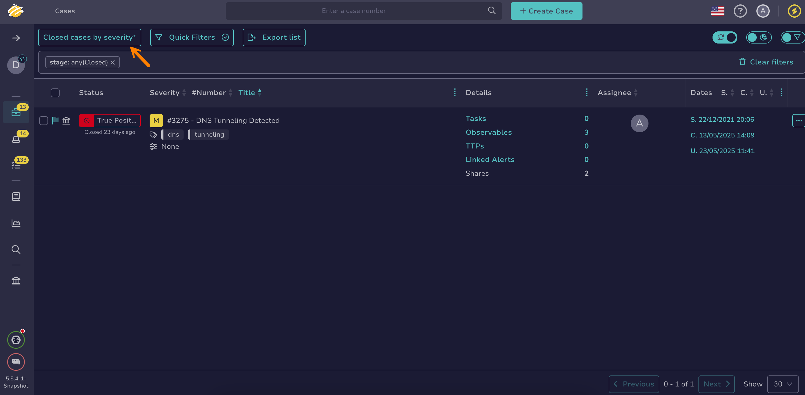

# Create a Custom View

Create a custom [view](about-views.md) in TheHive to save your filters and sorting preferences applied to a list for easy reuse.

!!! info "Beta feature available for filters and views"
    <!-- md:version 5.5.6 --> A beta feature to enhance user experience for filters and views is available for testing on lists of cases, alerts, tasks, and observables. For detailed instructions on how to activate this beta feature, see [Activate the Beta of Filters and Views](../../../user-guides/manage-user-settings.md#activate-the-beta-of-filters-and-views).

<h2>Procedure</h2>

1. Adjust the [filters and sorting](../about-filtering-and-sorting.md) on the list as desired.

2. Select the current view name followed by an asterisk (*\**).

    

3. Select **Save view as** to save your changes as a new view.

4. In the **Save current view** drawer, enter the name of the view.

5. Select **Confirm**.

<h2>Next steps</h2>

* [Update a Custom View](update-a-custom-view.md)
* [Delete a Custom View](delete-a-custom-view.md)